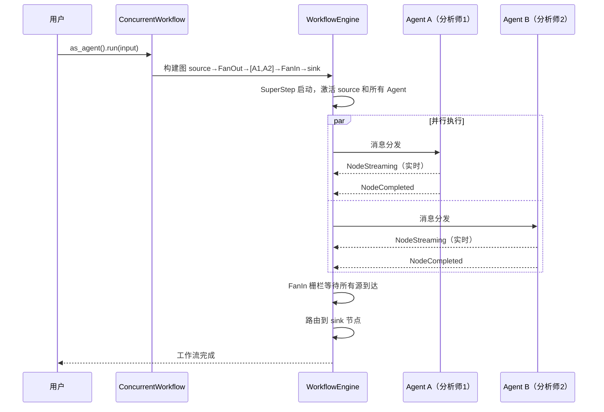

# 11.3 ConcurrentWorkflow 并发编排

`ConcurrentWorkflow` 实现了 Fan-out/Fan-in 模式的 Agent 编排——所有 Agent 并行处理相同的输入，由 `WorkflowEngine` 驱动执行，自动获得并存控制、超时和完整事件流。

## 执行流程



内部建图：`source → FanOutEdge → [Agent₁, ..., Agentₙ] → FanInEdge → sink(aggregator) → output`

## API 参考

### ConcurrentWorkflowBuilder（对齐 MAF）

```rust
use rust_agent_workflow::ConcurrentWorkflowBuilder;

let workflow = ConcurrentWorkflowBuilder::new()
    .add_agent(analyst_a)
    .add_agent(analyst_b)
    .add_agent(analyst_c)
    .build()?;

let agent: Arc<dyn IAgent> = workflow.as_agent();
let stream = agent.run(input, session, None).await?;
```

### 快捷构造

```rust
let workflow = ConcurrentWorkflow::from_agents(vec![
    analyst_a, analyst_b, analyst_c,
])?;

// 返回引擎双流（事件流 + 输出流）
let (events, outputs) = workflow.run(input, session, None).await?;

// 向后兼容单流接口
let stream = workflow.run_agent(input, session, None).await?;
```

## 内部实现

`ConcurrentWorkflow` 通过 `WorkflowBuilder` 构建 FanOut/FanIn 图：

```rust
fn from_agents(agents: Vec<Arc<dyn IAgent>>) -> Result<Self> {
    let mut builder = WorkflowBuilder::new();

    // 源节点：消息分发
    builder.add_node("concurrent_source",
        Arc::new(FunctionExecutor::new("concurrent_source", |msg: Vec<ChatMessage>| vec![msg])));

    // FanOut 到所有 Agent
    let mut agent_ids = vec![];
    for (i, agent) in agents.iter().enumerate() {
        let node_id = format!("concurrent_agent_{}", i);
        builder.add_node(node_id.clone(),
            Arc::new(AgentExecutor::new(node_id.clone(), agent.clone())));
        agent_ids.push(node_id);
    }
    builder.add_fan_out_edge("concurrent_source", agent_ids.clone());

    // FanIn 汇聚
    builder.add_node("concurrent_sink",
        Arc::new(FunctionExecutor::new("concurrent_sink", |_msg: String| vec!["aggregated".into()])));
    builder.add_fan_in_edge(agent_ids, "concurrent_sink");
    builder.with_output_from("concurrent_sink");

    builder.build()
}
```

**并发控制**：通过 `WorkflowConfig.max_parallel_nodes` 限制同批执行的节点数。

## 完整示例

```rust
use std::sync::Arc;
use rust_agent_core::{IAgent, ChatMessage, Content};
use rust_agent_workflow::ConcurrentWorkflowBuilder;
use rust_agent_framework::AgentBuilder;
use futures_util::StreamExt;

async fn build_analysts(client: DeepSeekChatClient) -> Vec<Arc<dyn IAgent>> {
    vec![
        AgentBuilder::new("tech_analyst")
            .chat_client(client.clone())
            .instructions("你是技术分析师。从技术可行性角度分析。")
            .build()?,
        AgentBuilder::new("biz_analyst")
            .chat_client(client.clone())
            .instructions("你是商业分析师。从商业价值角度评估。")
            .build()?,
    ]
}

async fn run_parallel_analysis() -> anyhow::Result<()> {
    let client = DeepSeekChatClient::new(/* ... */)?;
    let analysts = build_analysts(client).await;

    let workflow = ConcurrentWorkflowBuilder::new()
        .with_agents(analysts)
        .build()?;

    let agent: Arc<dyn IAgent> = workflow.as_agent();
    let input = vec![ChatMessage::user("评估 Rust+WebAssembly 方案")];

    let mut stream = agent.run(input, None, None).await?;

    println!("=== 多方并行分析 ===");
    while let Some(chunk) = stream.next().await {
        match chunk {
            Ok(result) => {
                for content in &result.contents {
                    if let Content::Text(ref t) = content {
                        print!("{}", t.delta);
                    }
                }
            }
            Err(e) => eprintln!("\n[错误: {}]", e),
        }
    }

    Ok(())
}
```

## 适用场景

| 场景 | 说明 |
|------|------|
| 多方分析 | 技术、商业、风险等多角度并行评估 |
| A/B 对比 | 不同提示词或模型处理同一问题，对比结果 |
| 众包式解答 | 多个 Agent 各自给出答案，由用户选择最佳方案 |
| 并行数据处理 | 将大任务拆分为独立子任务并发处理 |

## 注意事项

1. **并发限流**：通过 `WorkflowConfig.max_parallel_nodes` 控制，避免同时发起过多 LLM API 调用
2. **FanIn 栅栏**：所有 Agent 完成后才触发 sink 节点，确保完整性
3. **引擎驱动**：内部由 WorkflowEngine 执行，自动获得检查点和完整事件流
4. **向后兼容**：`FanOutWorkflow`、`ParallelWorkflow`、`ConcurrentPattern` 别名保留
