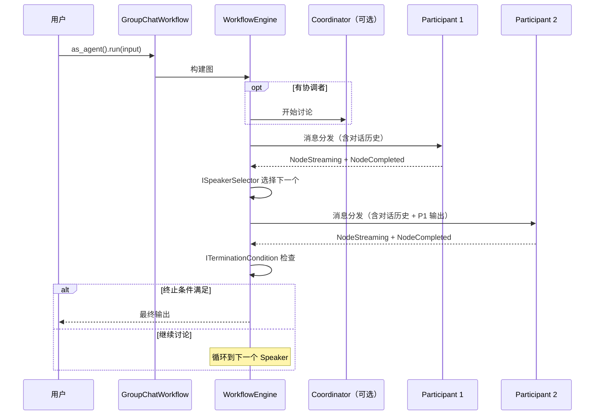

# 11.5 GroupChatWorkflow 群聊编排

`GroupChatWorkflow` 实现了多 Agent 轮流讨论的协作模式——多个参与者按顺序或由协调者调度依次发言，参与者可以看到完整的对话历史后进行回复，直到满足终止条件。

## 执行流程



## 核心接口

### ISpeakerSelector — 发言者选择

```rust
pub trait ISpeakerSelector: Send + Sync {
    fn select_next(
        &self,
        history: &[ChatMessage],
        participants: &[Arc<dyn IAgent>],
    ) -> Result<usize>;
}
```

### ITerminationCondition — 终止条件

```rust
pub trait ITerminationCondition: Send + Sync {
    fn should_terminate(&self, history: &[ChatMessage]) -> bool;
}
```

## 内置策略

| 策略 | 类型 | 说明 |
|------|------|------|
| `RoundRobinSelector` | ISpeakerSelector | 按固定顺序轮流发言 |
| `LLMCoordinatorSelector` | ISpeakerSelector | 由 Coordinator Agent 决定下一发言人 |
| `FixedOrderSelector` | ISpeakerSelector | 按预定义顺序选择 |
| `MaxRoundsTermination` | ITerminationCondition | 达到最大轮次后终止 |
| `KeywordTermination` | ITerminationCondition | 出现特定关键词后终止 |

## API 参考

### GroupChatWorkflowBuilder（对齐 MAF）

```rust
use rust_agent_workflow::{
    GroupChatWorkflowBuilder,
    RoundRobinSelector, MaxRoundsTermination,
};

let workflow = GroupChatWorkflowBuilder::new()
    .add_participant(analyst_a)
    .add_participant(analyst_b)
    .add_participant(analyst_c)
    .coordinator(orchestrator)       // 可选
    .max_rounds(10)
    .build()?;

let agent: Arc<dyn IAgent> = workflow.as_agent();
let stream = agent.run(messages, session, None).await?;
```

### 自定义策略

```rust
use rust_agent_workflow::{ISpeakerSelector, ITerminationCondition};

struct MySelector;
impl ISpeakerSelector for MySelector {
    fn select_next(&self, history: &[ChatMessage],
                    participants: &[Arc<dyn IAgent>]) -> Result<usize> {
        // 实现自定义选择逻辑
        Ok(0)
    }
}

struct MyTermination;
impl ITerminationCondition for MyTermination {
    fn should_terminate(&self, history: &[ChatMessage]) -> bool {
        // 实现自定义终止逻辑
        history.len() >= 20
    }
}
```

## 完整示例

```rust
use std::sync::Arc;
use rust_agent_core::{IAgent, ChatMessage, Content};
use rust_agent_workflow::{
    GroupChatWorkflowBuilder,
    MaxRoundsTermination,
};
use rust_agent_framework::AgentBuilder;
use futures_util::StreamExt;

async fn run_discussion() -> anyhow::Result<()> {
    let client = DeepSeekChatClient::new(/* ... */)?;

    let tech_agent = AgentBuilder::new("tech")
        .chat_client(client.clone())
        .instructions("你是技术专家。从技术角度分析。")
        .build()?;

    let biz_agent = AgentBuilder::new("biz")
        .chat_client(client.clone())
        .instructions("你是商业专家。从商业角度分析。")
        .build()?;

    let reviewer = AgentBuilder::new("reviewer")
        .chat_client(client.clone())
        .instructions("你是评审员。综合前两位专家的观点给出最终建议。")
        .build()?;

    let workflow = GroupChatWorkflowBuilder::new()
        .add_participant(tech_agent)
        .add_participant(biz_agent)
        .add_participant(reviewer)
        .max_rounds(3)
        .build()?;

    let agent: Arc<dyn IAgent> = workflow.as_agent();
    let input = vec![ChatMessage::user("评估在金融领域引入 AI 的可行性")];

    let mut stream = agent.run(input, None, None).await?;
    while let Some(chunk) = stream.next().await {
        if let Ok(result) = chunk {
            for content in &result.contents {
                if let Content::Text(ref t) = content {
                    print!("{}", t.delta);
                }
            }
        }
    }

    Ok(())
}
```

## 适用场景

| 场景 | 说明 |
|------|------|
| 技术评审会 | 多角色从不同角度讨论方案 |
| 头脑风暴 | 多 Agent 轮流提出创意 |
| 辩论模拟 | 正反方交替陈述观点 |
| 协作写作 | 初稿 → 审阅 → 修订 多轮迭代 |

## 注意事项

1. **内部引擎驱动**：由 `WorkflowEngine` 按 SuperStep 执行，获得完整事件流
2. **对话历史传递**：参与者通过 Session 看到完整对话历史
3. **终止条件**：`max_rounds` 提供硬上限防止无限循环，`ITerminationCondition` 提供智能终止
4. **Coordinator 可用**：可选的 Coordinator Agent 作为协调者，管理讨论流程
