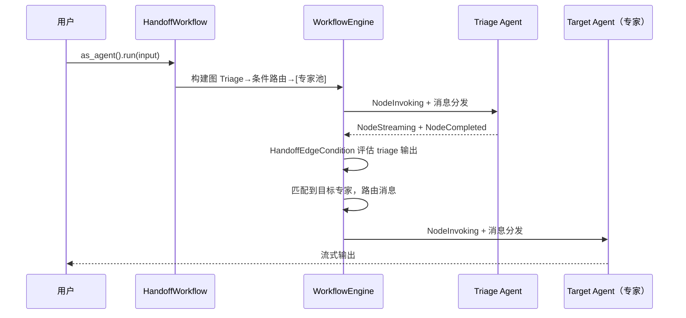

# 11.4 HandoffWorkflow 交接编排

`HandoffWorkflow` 实现了智能路由（Triage）模式——一个分类 Agent 分析用户请求后，通过条件路由将其交接给最合适的专业 Agent 处理。内部由 `WorkflowEngine` 驱动，利用 `HandoffEdgeCondition` 实现基于 triage 输出的条件边。

## 执行流程



内部建图：`TriageAgent → DirectEdge(with HandoffEdgeCondition) → [Expert₁, ..., Expertₙ]`

## API 参考

### HandoffWorkflowBuilder（对齐 MAF）

```rust
use rust_agent_workflow::HandoffWorkflowBuilder;

let workflow = HandoffWorkflowBuilder::new()
    .triage(triage_agent)       // 必须：分诊 Agent
    .add_agent(code_agent)       // 目标 Agent 1
    .add_agent(writing_agent)    // 目标 Agent 2
    .add_agent(analysis_agent)   // 目标 Agent 3
    .build()?;

let agent: Arc<dyn IAgent> = workflow.as_agent();
let stream = agent.run(messages, session, None).await?;
```

### 关键约束

- `triage()` 必须调用，设置分诊 Agent
- 至少调用一次 `add_agent()`（添加至少一个目标 Agent）
- Agent 的匹配名称优先使用 `AgentMetadata.description`，为空则回退到 `AgentId`
- 支持 `find_agent(&AgentId)` 手动查找子 Agent

## HandoffEdgeCondition

内部通过条件边实现路由：

```rust
/// 转交边条件 —— 检查 triage Agent 输出是否包含特定专家名称。
pub struct HandoffEdgeCondition {
    target_name: String,
    triage_output: Arc<Mutex<Option<String>>>,
}

#[async_trait]
impl IEdgeCondition for HandoffEdgeCondition {
    async fn evaluate(&self, envelope: &MessageEnvelope) -> Result<bool> {
        if let Some(msg) = envelope.content.downcast_ref::<ChatMessage>() {
            let text = &msg.content;
            let matched = text.to_lowercase()
                .contains(&self.target_name.to_lowercase());
            return Ok(matched);
        }
        Ok(false)
    }
}
```

每个专家节点对应一个 `HandoffEdgeCondition` 实例，当 triage 输出的文本包含对应名称时，该条件返回 `true`，消息沿该边传递。

## 与旧版差异

| 方面 | 旧版 HandoffPattern | 新版 HandoffWorkflow |
|------|-------------------|---------------------|
| 构建入口 | `HandoffWorkflow::new()` | `HandoffWorkflowBuilder::new()` |
| 添加专家 | `.agent(agent)` | `.add_agent(agent)` |
| 执行引擎 | 直接调用 `IAgent::run()` | `WorkflowEngine` 驱动 |
| 路由方式 | 收集 triage 文本后匹配 | `HandoffEdgeCondition` 条件边 |
| 检查点 | 不支持 | 自动支持 |
| 事件流 | 无 | 完整 `WorkflowEvent` 流 |

## 完整示例

```rust
use std::sync::Arc;
use rust_agent_core::{IAgent, ChatMessage, Content};
use rust_agent_workflow::HandoffWorkflowBuilder;
use rust_agent_framework::AgentBuilder;
use futures_util::StreamExt;

async fn build_handoff_system(
    client: DeepSeekChatClient,
) -> anyhow::Result<()> {
    // 分诊 Agent
    let triage = AgentBuilder::new("triage")
        .chat_client(client.clone())
        .instructions("你是智能路由员。分析用户请求并确定最合适的专家。")
        .build()?;

    // 代码专家
    let coder = AgentBuilder::new("coder")
        .chat_client(client.clone())
        .instructions("你是资深软件工程师。")
        .with_description("代码专家")
        .build()?;

    // 写作专家
    let writer = AgentBuilder::new("writer")
        .chat_client(client.clone())
        .instructions("你是专业作家。")
        .with_description("写作专家")
        .build()?;

    let workflow = HandoffWorkflowBuilder::new()
        .triage(triage)
        .add_agent(coder)
        .add_agent(writer)
        .build()?;

    let agent: Arc<dyn IAgent> = workflow.as_agent();

    // 测试路由
    let code_req = vec![ChatMessage::user("写一个 Rust 快速排序")];
    let mut stream = agent.run(code_req, None, None).await?;
    while let Some(chunk) = stream.next().await {
        if let Ok(result) = chunk {
            for c in &result.contents {
                if let Content::Text(ref t) = c { print!("{}", t.delta); }
            }
        }
    }

    Ok(())
}
```

## 适用场景

| 场景 | 说明 |
|------|------|
| 客服系统 | 路由到技术支持/账单/账户等专员 |
| 多领域问答 | 根据问题领域自动分配专家 Agent |
| 企业门户 | 不同类型的员工自助服务请求分发 |
| 代码助手 | 区分前端/后端/数据库等专业领域 |

## 注意事项

1. **匹配精度**：基于不区分大小写的子串匹配，建议为每个 Agent 显式设置有意义的 `description`
2. **容错性**：无匹配时走回退路径（默认边将消息路由到备用节点）
3. **引擎驱动**：所有 Agent 执行通过 WorkflowEngine 进行，获得事件流和检查点
4. **向后兼容**：`HandoffBuilder` 别名和 `HandoffPattern` 别名仍可用
