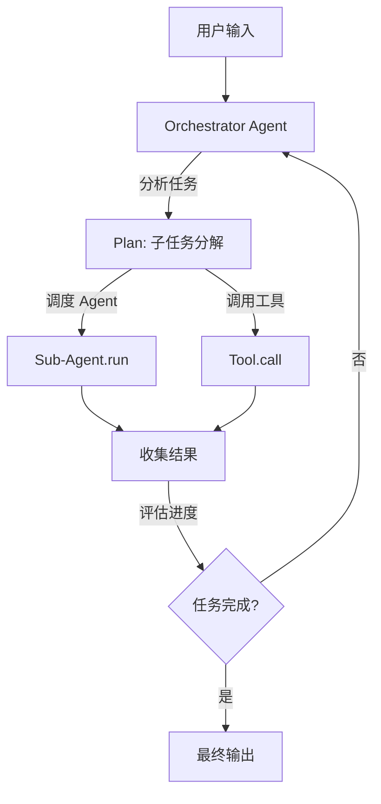

# 11.7 MagenticWorkflow 自主编排

`MagenticWorkflow` 实现了自主多 Agent 编排模式（对齐 MAF Magentic-One）——一个 Orchestrator Agent 通过推理-行动循环（ReAct loop）自主分解任务，动态调度子 Agent 和工具完成复杂目标。

## 执行流程



每次"推理 → 调度 → 收集 → 评估"为一个 SuperStep，由 `WorkflowEngine` 驱动执行。所有调度过程产生完整的 `WorkflowEvent` 事件流。

## API 参考

### MagenticWorkflowBuilder（对齐 MAF）

```rust
use rust_agent_workflow::MagenticWorkflowBuilder;

let workflow = MagenticWorkflowBuilder::new()
    .orchestrator(main_agent)      // 主控 Agent（推理+决策）
    .add_sub_agent(coder)           // 子 Agent
    .add_sub_agent(reviewer)        // 子 Agent
    .add_tool(search_tool)          // 可用工具
    .max_iterations(10)             // 最大推理轮次
    .build()?;

let agent: Arc<dyn IAgent> = workflow.as_agent();
let stream = agent.run(messages, session, None).await?;
```

### 配置选项

| 方法 | 说明 |
|------|------|
| `orchestrator(agent)` | 必须：设置主控 Orchestrator Agent |
| `add_sub_agent(agent)` | 添加可调度的子 Agent |
| `add_tool(tool)` | 添加 Orchestrator 可用的工具 |
| `max_iterations(n)` | 最大推理-行动轮次（默认 10） |

## 内部架构

```rust
pub struct MagenticWorkflow {
    orchestrator_id: String,                            // Orchestrator 节点 ID
    sub_agents: Vec<Arc<dyn IAgent>>,                   // 可调度子 Agent 池
    tools: Vec<Arc<dyn ITool>>,                         // 可用工具集
    max_iterations: usize,                              // 最大推理轮次
    graph: WorkflowGraph,                               // 引擎执行图
}
```

内部建图：`Orchestrator → FanOut → [SubAgent₁, ..., SubAgentₙ]`，每个子 Agent 节点可产出输出。

## 完整示例

```rust
use std::sync::Arc;
use rust_agent_core::{IAgent, ChatMessage, Content, ITool};
use rust_agent_workflow::MagenticWorkflowBuilder;
use rust_agent_framework::AgentBuilder;
use futures_util::StreamExt;

async fn run_magentic_task() -> anyhow::Result<()> {
    let client = DeepSeekChatClient::new(/* ... */)?;

    // Orchestrator — 负责任务分解和调度决策
    let orchestrator = AgentBuilder::new("orchestrator")
        .chat_client(client.clone())
        .instructions(
            "你是任务编排员。分析用户的复杂请求，将其分解为可执行的子任务。\n\
             可用专家：coder（代码）、reviewer（审查）、analyst（分析）。\n\
             每次响应只调度一个专家或调用一个工具，然后评估结果。"
        )
        .build()?;

    // 子 Agent：代码专家
    let coder = AgentBuilder::new("coder")
        .chat_client(client.clone())
        .instructions("你是代码专家。生成高质量代码。")
        .with_description("代码专家")
        .build()?;

    // 子 Agent：审查专家
    let reviewer = AgentBuilder::new("reviewer")
        .chat_client(client.clone())
        .instructions("你是代码审查员。审查代码并给出建议。")
        .with_description("审查专家")
        .build()?;

    let workflow = MagenticWorkflowBuilder::new()
        .orchestrator(orchestrator)
        .add_sub_agent(coder)
        .add_sub_agent(reviewer)
        .max_iterations(10)
        .build()?;

    let agent: Arc<dyn IAgent> = workflow.as_agent();

    let input = vec![ChatMessage::user(
        "设计一个 Rust 实现的分布式任务队列，包括生产者、消费者和调度器模块。"
    )];

    let mut stream = agent.run(input, None, None).await?;
    while let Some(chunk) = stream.next().await {
        if let Ok(result) = chunk {
            for content in &result.contents {
                if let Content::Text(ref t) = content {
                    print!("{}", t.delta);
                }
            }
        }
    }

    Ok(())
}
```

## 适用场景

| 场景 | 说明 |
|------|------|
| 复杂任务分解 | Orchestrator 将大任务分解为子任务，逐一委托 |
| 动态工作流 | 执行路径由 Orchestrator 在运行时根据中间结果决定 |
| 多工具编排 | Orchestrator 选择合适工具处理每个子步骤 |
| 迭代优化 | 多轮"生成→审查→修改"循环达到满意结果 |

## 与 HandoffWorkflow 的区别

| 方面 | HandoffWorkflow | MagenticWorkflow |
|------|----------------|------------------|
| 路由方式 | Triage 选择一个专家 | Orchestrator 动态调度多个专家 |
| 轮次 | 一次路由，单专家执行 | 多轮推理-行动循环 |
| 任务粒度 | 整体任务分配 | 子任务分解 + 逐步执行 |
| 适用场景 | 明确领域分类 | 复杂、需多步推理的任务 |

## 注意事项

1. **max_iterations**：安全上限，防止 Orchestrator 无限循环
2. **事件可观测**：Orchestrator 和每个子 Agent 的调度过程通过 `WorkflowEvent` 完全可见
3. **引擎驱动**：内部由 WorkflowEngine 执行，自动获得检查点、重试、超时
4. **子 Agent 发现**：可通过 `get_subagent()` 获取子 Agent 引用
