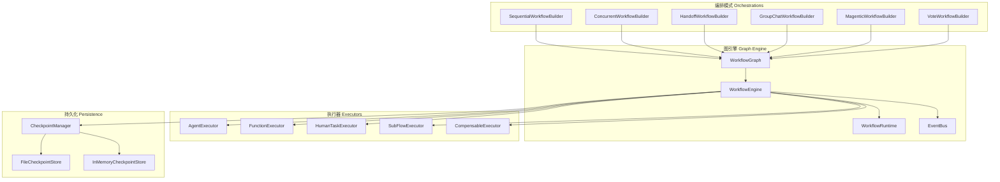
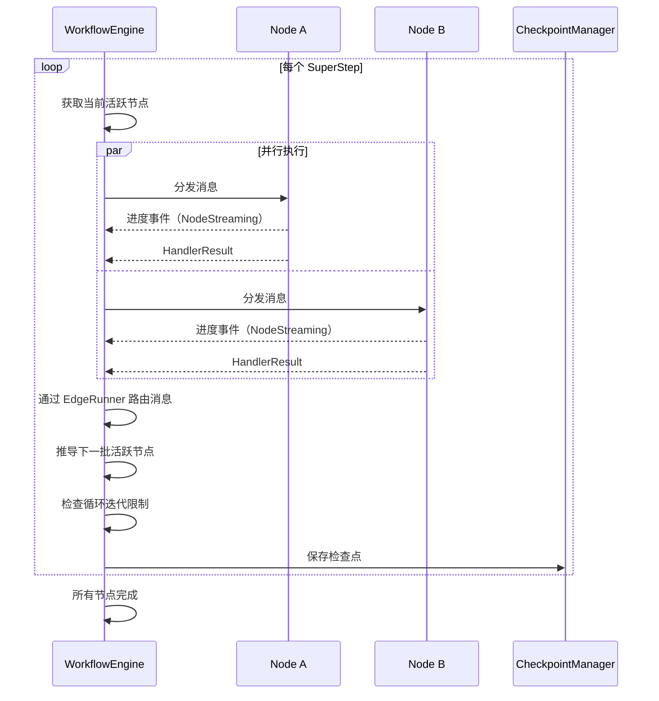

# 11.1 编排引擎概述

RAF 的多智能体编排引擎是一个图驱动的异步工作流执行系统，参考 Microsoft Agent Framework (MAF) 的 Orchestrator 设计模式，提供完整的图拓扑定义、SuperStep 执行模型、状态管理、检查点恢复、事件驱动机制和全链路流式可观测性。

## 核心架构



## 核心设计链路

所有编排模式统一的构建-执行-门面链路：

```
XXXWorkflowBuilder.build() → Workflow.as_agent() → IAgent
```

前端与编排系统只与 `IAgent` 接口交互，编排细节（图结构、SuperStep、边路由）完全透明。

## 关键组件

### WorkflowGraph — 不可变图定义

`WorkflowGraph` 是工作流的唯一真相来源。它定义了不可变拓扑结构，通过 `WorkflowBuilder` 构建后冻结。

```rust
pub struct WorkflowGraph {
    nodes: HashMap<String, Node>,           // 全部节点，按 ID 索引
    edges: HashMap<String, HashSet<Edge>>,  // 边，按源节点 ID 分组
    ports: HashMap<String, RequestPort>,    // 外部请求端口
    output_node_ids: HashSet<String>,       // 标记为输出的节点 ID
    start_node_id: String,                  // 入口节点 ID
}
```

图构建后自动执行验证：
- **入口节点存在性**：`start_node_id` 必须在 `nodes` 中
- **边引用完整性**：所有边的源和目标节点必须存在
- **BFS 可达性**：从入口出发的所有可达节点检测；不可达节点仅产生警告
- **DFS 环检测**：三色标记法检测有向图中的环；显式标记 `is_loopback = true` 的边不会被检测为环

### Node — 图节点

每个节点关联一个执行器，并支持多种运行时配置：

```rust
pub struct Node {
    pub id: String,
    pub executor: Arc<dyn IExecutor>,
    pub is_output: bool,
    pub retry: Option<RetryConfig>,     // 节点重试策略
    pub timeout: Option<Duration>,      // 单节点超时
    pub loop_config: Option<LoopConfig>, // 循环配置（最大迭代次数、循环变量）
}
```

### Edge — 有向边

支持三种边类型，实现灵活的消息路由：

| 边类型 | API | 行为 |
|--------|-----|------|
| `DirectEdge` | `add_edge(src, dst)` | 1:1 路由，支持 `IEdgeCondition` 条件过滤 |
| `FanOutEdge` | `add_fan_out_edge(src, vec![...])` | 1:N 广播，消息通过 `Arc` 零拷贝共享 |
| `FanInEdge` | `add_fan_in_edge(vec![...], dst)` | N:1 栅栏同步，所有源到达后才触发目标 |
| `LoopbackEdge` | `add_loopback_edge(src, dst)` | 显式标记的循环回边，图校验允许 |

```rust
pub struct DirectEdgeData {
    pub edge_id: EdgeId,
    pub source_id: String,
    pub sink_id: String,
    pub label: Option<String>,
    pub condition: Option<Arc<dyn IEdgeCondition>>,
    pub is_loopback: bool,  // 标记为循环回边
}
```

### IExecutor — 执行器接口

每个节点通过 `IExecutor` 定义其运行时行为，支持完整的生命周期钩子：

```rust
#[async_trait]
pub trait IExecutor: Send + Sync {
    fn id(&self) -> &str;
    fn accepted_types(&self) -> Vec<TypeTag>;
    fn send_types(&self) -> Vec<TypeTag>;
    fn is_output(&self) -> bool;

    // 生命周期钩子
    async fn on_init(&self, ctx: &dyn IWorkflowContext) -> Result<()>;
    async fn on_checkpoint_save(&self, ctx: &dyn IWorkflowContext) -> Result<()>;
    async fn on_checkpoint_restore(&self, ctx: &dyn IWorkflowContext) -> Result<()>;
    async fn on_delivery_start(&self, ctx: &dyn IWorkflowContext) -> Result<()>;
    async fn on_delivery_end(&self, ctx: &dyn IWorkflowContext) -> Result<()>;
    async fn on_timer(&self, timer_name: &str, ctx: &dyn IWorkflowContext) -> Result<()>;
    async fn compensate(&self, ctx: &dyn IWorkflowContext) -> Result<()>;

    // 核心执行
    async fn handle(
        &self,
        message: Arc<dyn Any + Send + Sync>,
        ctx: &dyn IWorkflowContext,
        progress: UnboundedSender<NodeProgress>,
    ) -> Result<HandlerResult>;
}
```

## SuperStep 执行模型

RAF 采用 SuperStep 模型（类似 Google Pregel 的批量同步并行计算模型）：



每个 SuperStep 支持：
- **并发控制**：通过 `Semaphore` 限制 `max_parallel_nodes`
- **节点超时**：每个节点独立超时（`Node.timeout`）
- **全局超时**：工作流整体超时（`WorkflowConfig.global_timeout`）
- **节点重试**：指数退避，支持 `Fail/Skip/FallbackNode` 耗尽策略
- **补偿回滚**：节点失败后沿执行链反向调用 `compensate()`
- **定时器**：节点可注册定时器，引擎在 SuperStep 循环中 poll 到期检查

## 流式可观测性：WorkflowEvent

整个编排过程通过事件流对外暴露，实现完全可观测：

```rust
#[derive(Clone, Serialize)]
#[serde(tag = "event_type", content = "data")]
pub enum WorkflowEvent {
    // 工作流生命周期
    WorkflowStarted { session_id, graph_node_ids, start_node_id },
    WorkflowCompleted { total_steps, total_nodes, total_usage },
    WorkflowError { error, node_id },
    WorkflowTimeout { elapsed },

    // SuperStep 生命周期
    SuperStepStarted { step_number, active_nodes },
    SuperStepCompleted { step_number, outputs_count },

    // 节点生命周期
    NodeInvoking { node_id, node_name, step_number },
    NodeStreaming { node_id, chunk: NodeChunk },
    NodeCompleted { node_id, messages_produced, usage },
    NodeFailed { node_id, error },

    // 暂停/恢复
    WorkflowHalted { step_number, reason },
    WorkflowResumed { step_number },

    // 定时器/外部事件
    TimerFired { node_id, timer_name },
    ExternalEventReceived { port_id, signal_name, timer_id, timestamp },

    // 自定义
    Custom { key, data },
}
```

每个 `NodeStreaming` 携带 `node_id`，前端可据此实现：
- DAG 图实时高亮（`NodeInvoking` 变色，`NodeCompleted` 绿色）
- 每节点独立打字机效果（按 `node_id` 分组展示）
- 工具调用卡片（`ToolCallStart` / `ToolCallArgs` / `ToolCallEnd` / `ToolResult`）
- 多节点并行进度条
- Token 用量仪表（`UsageUpdate` 累计）

## 执行器类型一览

| 执行器 | 用途 | 特点 |
|--------|------|------|
| `AgentExecutor` | 包装 `IAgent` 为 `IExecutor` | 流式桥接 IA 到引擎，全链路 Streaming |
| `FunctionExecutor` | 执行纯函数/闭包 | 泛型参数 I→O，用于条件判断、数据转换 |
| `HumanTaskExecutor` | 人工审批/输入 | 暂停工作流等待外部 `ResumeCommand` 注入 |
| `SubFlowExecutor` | 动态子流程 | 运行时构造子图并作为子引擎执行 |
| `CompensableExecutor` | Saga 补偿 | 为任意 Executor 附加补偿函数 |

## 事件驱动机制

工作流引擎支持外部事件注入：

```rust
pub enum ExternalEvent {
    MessageReceived { port_id: String, payload: Value },
    SignalReceived { signal_name: String, payload: Value },
    TimerElapsed { timer_id: String },
}
```

通过 `EventBus`（基于 tokio broadcast channel）进行事件分发。外部系统通过 `WorkflowEngine::inject_event()` 注入事件，引擎将其包装为 `WorkflowEvent::ExternalEventReceived` 广播。

## 编排模式总览

RAF 提供六种编排模式，每种通过专属 Builder 构建：

| 编排模式 | Builder | 适用场景 | 对应 MAF |
|---------|---------|---------|---------|
| **Sequential** | `SequentialWorkflowBuilder` | 流水线处理、阶段性任务 | `SequentialWorkflow` |
| **Concurrent** | `ConcurrentWorkflowBuilder` | 并行分析、多角度评估 | `ConcurrentWorkflow` |
| **Handoff** | `HandoffWorkflowBuilder` | 智能路由、专家分发 | `HandoffWorkflow` |
| **GroupChat** | `GroupChatWorkflowBuilder` | 多 Agent 讨论、轮流发言 | `GroupChatWorkflow` |
| **Magentic** | `MagenticWorkflowBuilder` | 自主编排、推理-行动循环 | `MagenticOne` |
| **Vote** | `VoteWorkflowBuilder` | 投票聚合、多方决策 | — |

所有编排模式内部由 `WorkflowEngine` 驱动，自动获得检查点、重试、超时、事件等基础设施能力。每种模式通过 `as_agent()` 收敛为 `Arc<dyn IAgent>` 统一门面。

## Builder DSL 网关语义

`WorkflowBuilder` 提供声明式网关 DSL：

| 网关 | 方法 | 行为 |
|------|------|------|
| 并行网关 | `parallel_gateway(src, branches)` | 自动创建 FanOut 边，所有分支同时执行 |
| 排他网关 | `exclusive_gateway(src, branches, default)` | 据条件创建多条带条件的 DirectEdge，仅一条激活 |
| 包容网关 | `inclusive_gateway(src, branches)` | 所有满足条件的分支并行执行 |
