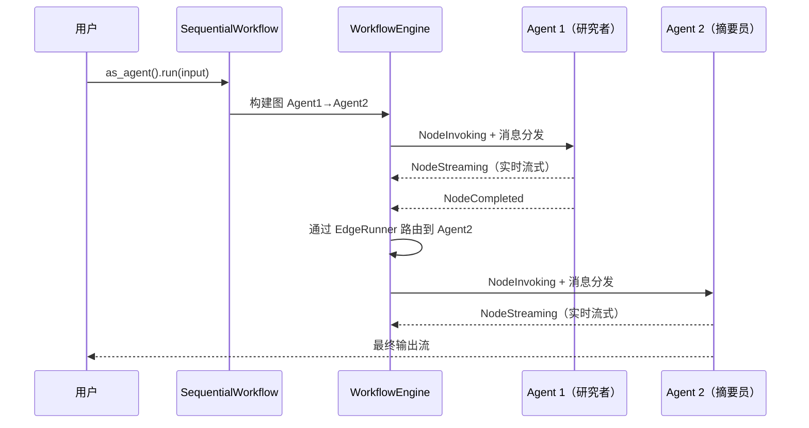

# 11.2 SequentialWorkflow 顺序编排

`SequentialWorkflow` 实现了流水线模式的 Agent 编排——Agent 按顺序链式执行，每个 Agent 接收前一个 Agent 的输出作为输入。内部由 `WorkflowEngine` 驱动，自动获得检查点、重试、超时、流式事件等基础设施能力。

## 执行流程



内部建图：`Agent1 → DirectEdge → Agent2 → ... → AgentN`，通过 `WorkflowAgent` 桥接为 IAgent。

## API 参考

### SequentialWorkflowBuilder（对齐 MAF）

```rust
use rust_agent_workflow::SequentialWorkflowBuilder;

let workflow = SequentialWorkflowBuilder::new()
    .add_agent(researcher)
    .add_agent(summarizer)
    .add_agent(translator)
    .build()?;

// 统一门面
let agent: Arc<dyn IAgent> = workflow.as_agent();
let stream = agent.run(messages, session, None).await?;
```

### 快捷构造

```rust
let workflow = SequentialWorkflow::from_agents(vec![
    researcher, summarizer, translator,
])?;

// 返回引擎双流
let (events, outputs) = workflow.run(input, session, None).await?;

// 或使用向后兼容的单流接口
let stream = workflow.run_agent(input, session, None).await?;
```

## 内部实现

`SequentialWorkflow` 通过 `WorkflowBuilder` 构建顺序图，由 `WorkflowEngine` 驱动：

```rust
fn from_agents(agents: Vec<Arc<dyn IAgent>>) -> Result<Self> {
    let mut builder = WorkflowBuilder::new();

    for (i, agent) in agents.iter().enumerate() {
        let node_id = format!("seq_agent_{}", i);
        builder = builder.add_node(
            node_id.clone(),
            Arc::new(AgentExecutor::new(node_id.clone(), agent.clone())),
        );
        if i > 0 {
            builder = builder.add_edge(&prev_id, &node_id);
        } else {
            builder = builder.set_start(node_id.clone());
        }
        prev_id = node_id.clone();
    }
    builder = builder.with_output_from(&prev_id);
    builder.build()
}
```

`as_agent()` 返回由 `WorkflowAgent` 封装的 IAgent，内部使用 WorkflowEngine 驱动执行。

## 完整示例

```rust
use std::sync::Arc;
use rust_agent_core::{IAgent, ChatMessage};
use rust_agent_workflow::SequentialWorkflowBuilder;
use rust_agent_framework::AgentBuilder;
use futures_util::StreamExt;

async fn run_documentation_pipeline() -> anyhow::Result<()> {
    let client = DeepSeekChatClient::new(/* ... */)?;

    // 研究员
    let researcher = AgentBuilder::new("researcher")
        .chat_client(client.clone())
        .instructions("你是信息研究员。收集并整理关于用户主题的全面信息。")
        .with_description("信息研究员")
        .max_tool_rounds(5)
        .build()?;

    // 摘要员
    let summarizer = AgentBuilder::new("summarizer")
        .chat_client(client.clone())
        .instructions("将输入内容精简为 3-5 个核心要点。")
        .with_description("内容摘要员")
        .build()?;

    // 构建工作流
    let workflow = SequentialWorkflowBuilder::new()
        .add_agent(researcher)
        .add_agent(summarizer)
        .build()?;

    let agent: Arc<dyn IAgent> = workflow.as_agent();
    let input = vec![ChatMessage::user("请研究 Rust 异步编程的最佳实践")];

    let mut stream = agent.run(input, None, None).await?;

    while let Some(chunk) = stream.next().await {
        match chunk {
            Ok(result) => {
                for content in &result.contents {
                    if let Content::Text(ref t) = content {
                        print!("{}", t.delta);
                    }
                }
            }
            Err(e) => eprintln!("错误: {}", e),
        }
    }

    Ok(())
}
```

## 适用场景

| 场景 | 说明 |
|------|------|
| 研究 → 摘要 → 翻译 | 信息处理流水线 |
| 代码生成 → 代码审查 → 测试生成 | 软件开发流水线 |
| 数据采集 → 数据清洗 → 分析报告 | 数据处理流水线 |
| 问题分析 → 方案设计 → 方案评审 | 决策流水线 |

## 注意事项

1. **引擎驱动**：内部由 WorkflowEngine 执行，自动获得检查点和完整事件流
2. **as_agent() 门面**：返回的 IAgent 可通过 `get_subagent()` 发现子 Agent
3. **错误处理**：如果中间 Agent 运行失败，引擎执行补偿回滚并返回错误
4. **向后兼容**：`from_agents()` 快捷构造和 `run_agent()` 单流接口保留，`SequentialPattern` 别名仍可用
