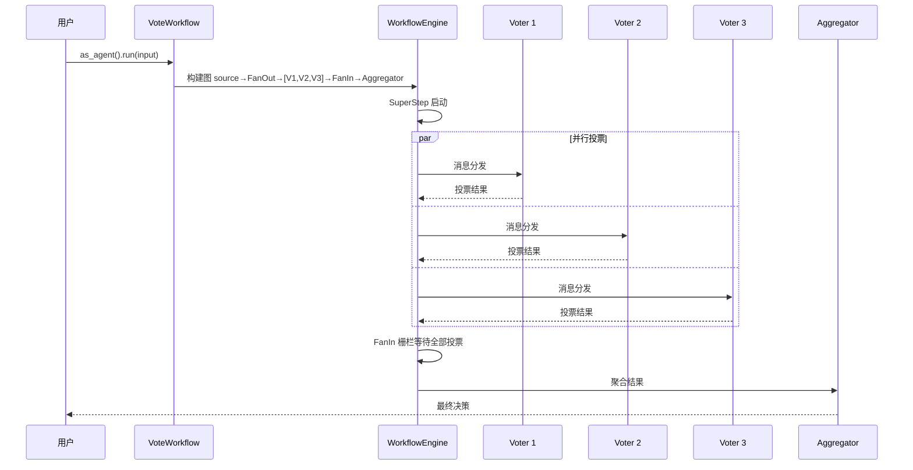

# 11.6 VoteWorkflow 投票聚合

`VoteWorkflow` 实现了投票聚合编排模式——多个 Voter Agent 并行对同一问题独立投票，结果通过聚合器（Aggregator）合并为最终决策。适用于需要多方共识的决策场景。

## 执行流程



内部建图：`source → FanOut → [Voter₁, ..., Voterₙ] → FanIn → Aggregator → output`

## 核心接口

### IVoteAggregator — 投票聚合策略

```rust
pub trait IVoteAggregator: Send + Sync {
    fn aggregate(&self, votes: &[String]) -> Result<String>;
}
```

## 内置聚合器

| 聚合器 | 策略 | 行为 |
|--------|------|------|
| `MajorityAggregator` | 多数决 | 出现次数最多的选项胜出 |
| `UnanimousAggregator` | 全票通过 | 所有投票相同则通过，否则返回错误 |
| `WeightedAggregator` | 加权投票 | 根据预设权重计算加权结果 |

## API 参考

### VoteWorkflowBuilder

```rust
use rust_agent_workflow::{
    VoteWorkflowBuilder, MajorityAggregator, WeightedAggregator,
};

// 多数决
let workflow = VoteWorkflowBuilder::new()
    .add_voter(analyst_a)
    .add_voter(analyst_b)
    .add_voter(analyst_c)
    .aggregator(MajorityAggregator)
    .build()?;

let agent: Arc<dyn IAgent> = workflow.as_agent();
let stream = agent.run(messages, session, None).await?;
```

### 加权投票

```rust
let workflow = VoteWorkflowBuilder::new()
    .add_voter(senior_analyst)   // 权重 0.5
    .add_voter(junior_analyst)   // 权重 0.3
    .add_voter(intern)           // 权重 0.2
    .aggregator(WeightedAggregator::new(vec![0.5, 0.3, 0.2]))
    .build()?;
```

### 自定义聚合器

```rust
use rust_agent_workflow::IVoteAggregator;

struct ConsensusAggregator {
    threshold: f64,
}

impl IVoteAggregator for ConsensusAggregator {
    fn aggregate(&self, votes: &[String]) -> Result<String> {
        use std::collections::HashMap;
        if votes.is_empty() {
            return Err(AgentError::WorkflowError("No votes".into()));
        }

        let total = votes.len() as f64;
        let mut counts: HashMap<&str, usize> = HashMap::new();
        for v in votes { *counts.entry(v.as_str()).or_default() += 1; }

        let (winner, count) = counts.iter()
            .max_by_key(|(_, &c)| c)
            .unwrap();

        if *count as f64 / total >= self.threshold {
            Ok(winner.to_string())
        } else {
            Err(AgentError::WorkflowError(
                format!("Consensus not reached: {:.0}%", *count as f64 / total * 100.0)
            ))
        }
    }
}
```

## 完整示例

```rust
use std::sync::Arc;
use rust_agent_core::{IAgent, ChatMessage, Content};
use rust_agent_workflow::{VoteWorkflowBuilder, MajorityAggregator};
use rust_agent_framework::AgentBuilder;
use futures_util::StreamExt;

async fn run_consensus_vote() -> anyhow::Result<()> {
    let client = DeepSeekChatClient::new(/* ... */)?;

    let voter_a = AgentBuilder::new("voter_a")
        .chat_client(client.clone())
        .instructions("你是评审专家。对方案给出'A-通过'、'B-修改后通过'或'C-否决'的投票。只输出投票结果。")
        .build()?;

    let voter_b = AgentBuilder::new("voter_b")
        .chat_client(client.clone())
        .instructions("你是评审专家。对方案给出'A-通过'、'B-修改后通过'或'C-否决'的投票。只输出投票结果。")
        .build()?;

    let voter_c = AgentBuilder::new("voter_c")
        .chat_client(client.clone())
        .instructions("你是评审专家。对方案给出'A-通过'、'B-修改后通过'或'C-否决'的投票。只输出投票结果。")
        .build()?;

    let workflow = VoteWorkflowBuilder::new()
        .add_voter(voter_a)
        .add_voter(voter_b)
        .add_voter(voter_c)
        .aggregator(MajorityAggregator)
        .build()?;

    let agent: Arc<dyn IAgent> = workflow.as_agent();
    let input = vec![ChatMessage::user("评审方案：在项目中使用 Rust 替代 C++ 作为主要开发语言")];

    let mut stream = agent.run(input, None, None).await?;
    while let Some(chunk) = stream.next().await {
        if let Ok(result) = chunk {
            for content in &result.contents {
                if let Content::Text(ref t) = content {
                    print!("{}", t.delta);
                }
            }
        }
    }

    Ok(())
}
```

## 适用场景

| 场景 | 说明 |
|------|------|
| 评审委员会 | 多位专家独立评审后聚合决策 |
| 多模型投票 | 不同 LLM 对同一问题独立回答后取多数 |
| 风险决策 | 多视角评估风险等级后加权聚合 |
| 质量审查 | 多个审查员独立评分后汇总 |

## 注意事项

1. **并行执行**：所有 Voter 在同一 SuperStep 中并行执行，响应时间约等于最慢的 Voter
2. **FanIn 栅栏**：所有 Voter 完成后才触发 Aggregator
3. **聚合器可扩展**：实现 `IVoteAggregator` trait 即可自定义聚合策略
4. **引擎驱动**：由 `WorkflowEngine` 驱动，自动获得事件流和检查点
