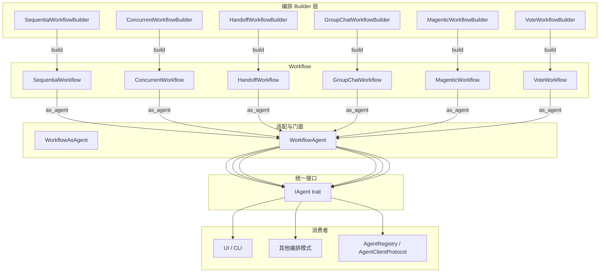

# 11.7 IAgent 统一门面

RAF 的核心设计哲学之一是"编排即 Agent"——任何工作流编排模式都可以通过统一的 `XXXWorkflowBuilder.build() → Workflow.as_agent() → IAgent` 链路收敛为 `IAgent` 接口。前端与编排系统只与 `IAgent` 交互，编排细节完全透明。

## 设计哲学



## 核心链路

```rust
// 所有 Workflow 收敛为 Arc<dyn IAgent>
let agent: Arc<dyn IAgent> = SequentialWorkflowBuilder::new()
    .add_agent(researcher)
    .add_agent(writer)
    .build()?
    .as_agent();

// 前端只与 IAgent 接口交互
agent.id()                        // agent 标识
agent.metadata()                  // 元信息（包含子 agent 列表）
agent.get_subagent(&child_id)     // 发现子 agent
agent.run(messages, session).await? // 流式执行
agent.reset().await?              // 递归重置
```

## 适配器实现

### WorkflowAsAgent（编排模式门面）

`WorkflowAsAgent` 将编排模式的 `run()` 方法包装为 `IAgent`：

```rust
pub struct WorkflowAsAgent {
    id: AgentId,
    metadata: AgentMetadata,
    agents: HashMap<AgentId, Arc<dyn IAgent>>,  // 子 Agent 注册表
    runner: StoredRunner,                        // 工作流的 run() 函数
}
```

用于 `SequentialWorkflow`、`ConcurrentWorkflow`、`HandoffWorkflow`、`GroupChatWorkflow`、`MagenticWorkflow`、`VoteWorkflow` 的 `as_agent()` 包装。

### WorkflowAgent（图引擎门面）

`WorkflowAgent` 将 `WorkflowEngine` 双流输出适配为 `IAgent` 的单流：

```rust
#[async_trait]
impl IAgent for WorkflowAgent {
    async fn run(&self, messages, session, _options)
        -> Result<BoxStream<'static, Result<AgentResponseResult>>>
    {
        // 内部：engine.run(initial_message, session)
        //       → (BoxStream<WorkflowEvent>, BoxStream<WorkflowOutput>)

        // 适配：WorkflowEvent::NodeStreaming
        //       → AgentResponseResult (逐事件转换)
        //       WorkflowEvent::NodeInvoking/NodeCompleted
        //       → Event::ExecutorInvoking/Invoked (嵌入事件)
    }
}
```

关键适配逻辑：
- `NodeInvoking` → `Event::ExecutorInvoking` —— 节点开始执行
- `NodeStreaming` → `Content::Text/Reasoning/ToolCall...` —— 流式内容逐帧转换
- `NodeCompleted` → `Event::ExecutorInvoked` —— 节点执行完成
- `NodeFailed` / `WorkflowError` → `AgentError::WorkflowError` —— 错误传播

## 各编排模式的 as_agent()

| 编排模式 | 生成的 Agent ID | 内部引擎 |
|---------|---------------|---------|
| SequentialWorkflow | `workflow_seq_agent_0` | WorkflowAgent(Engine) |
| ConcurrentWorkflow | `workflow_concurrent_source` | WorkflowAgent(Engine) |
| HandoffWorkflow | `workflow_handoff_triage` | WorkflowAgent(Engine) |
| GroupChatWorkflow | `workflow_group_chat_...` | WorkflowAgent(Engine) |
| MagenticWorkflow | `workflow_magentic_orchestrator` | WorkflowAgent(Engine) |
| VoteWorkflow | `workflow_vote_source` | WorkflowAgent(Engine) |

## 子 Agent 树发现

`get_subagent()` 方法支持递归发现和遍历 Agent 树：

```rust
// 通过 ACP 协议查询 Agent 树
let agent: Arc<dyn IAgent> = workflow.as_agent();

// 获取直接子 Agent
let sub = agent.get_subagent(&AgentId::new("code-expert"));

// 子 Agent 可独立运行
if let Some(sub_agent) = sub {
    let stream = sub_agent.run(messages, session, None).await?;
    // 独立消费子 Agent 流
}
```

`WorkflowAgent` 通过遍历节点的 `executor.as_agent()` 自动提取子 Agent 注册表。

## 嵌套编排

由于所有编排模式收敛为 `IAgent`，工作流可以递归嵌套：

```rust
// 子工作流
let sub_workflow = SequentialWorkflowBuilder::new()
    .add_agent(step1)
    .add_agent(step2)
    .build()?;

let sub_agent: Arc<dyn IAgent> = sub_workflow.as_agent();

// 子工作流作为 Concurrent 编排的一个节点
let main_workflow = ConcurrentWorkflowBuilder::new()
    .add_agent(sub_agent)         // 子工作流作为普通 Agent
    .add_agent(independent_agent)
    .build()?;

let agent: Arc<dyn IAgent> = main_workflow.as_agent();
```

嵌套工作流的 checkpoint 作为子 scope 管理，嵌套深度无限制。

## 事件流透传

`WorkflowAgent` 将引擎的全链路事件映射为 `AgentResponseResult`：

```
Engine 事件流              →  IAgent 响应流
━━━━━━━━━━━━━━━━━━━━━━━━━━━━━━━━━━━━━━━━━━━━━
NodeInvoking               →  Event::ExecutorInvoking
NodeStreaming(TextDelta)   →  Content::Text
NodeStreaming(ToolCall*)   →  Content::ToolCallStart/Args/End/Called
NodeStreaming(Reasoning)   →  Content::Reasoning
NodeStreaming(Usage)       →  Content::Usage
NodeCompleted              →  Event::ExecutorInvoked
NodeFailed                 →  AgentError::WorkflowError
WorkflowError              →  AgentError::WorkflowError
```

## 统一接口的优势

| 优势 | 说明 |
|------|------|
| **前端简化** | UI 无需区分单个 Agent 和工作流，统一交互模型 |
| **递归编排** | 工作流可以作为任何需要 IAgent 的上下文中的子组件 |
| **统一生命周期** | `reset()` 递归清理所有子 Agent 状态 |
| **可发现性** | `get_subagent()` 使前端能够渲染多 Agent 树视图 |
| **流式可观测** | 引擎事件全链路映射为 AgentResponseResult，前端逐帧消费 |

## 注意事项

1. **as_agent() 消耗 self**：`as_agent()` 取所有权，如需复用请先 clone
2. **子 Agent 发现**：`get_subagent()` 需要已知 AgentId，最佳实践是配合 AgentRegistry 使用
3. **reset 递归性**：`reset()` 递归重置所有子 Agent，适合完整的上下文清理
4. **门面开销**：引擎事件到 AgentResponseResult 的转换在独立 tokio task 中进行，不阻塞引擎执行
