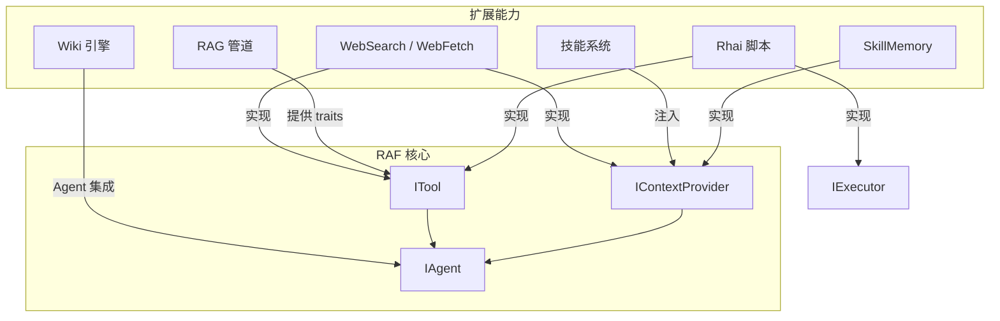

# 第 12 章：扩展能力

RAF 提供了丰富的扩展能力生态，包括网络搜索、RAG（检索增强生成）、Wiki 知识引擎、Agent 技能系统、Rhai 脚本引擎和持久记忆系统。本章详细介绍每一个扩展能力的架构和使用方式。

## 扩展生态概览

## 章节目录

| 小节 | 标题 | 内容概要 |
|------|------|---------|
| [12.1](overview.md) | 扩展体系概述 | 扩展机制、ITool 与 IContextProvider 插件点 |
| [12.2](websearch.md) | 网络搜索 | WebSearch、WebFetch、多后端、反检测、内容清洗 |
| [12.3](rag.md) | 检索增强生成（RAG） | 文档加载、分块、嵌入、向量存储、检索全管道 |
| [12.4](wiki.md) | Wiki 知识引擎 | 空间、全文搜索、概念图、Agent 集成 |
| [12.5](skills.md) | Agent 技能系统 | SKILL.md、AgentSkill、动态/目录加载 |
| [12.6](rhai-scripts.md) | Rhai 脚本引擎 | RhaiRuntime、RhaiExecutor、RhaiTool |
| [12.7](memory.md) | SkillMemory 记忆系统 | 后台记忆整合、MemoryAgent、ConsolidationWorker |

## 快速导航

- **想让 Agent 搜索互联网？** → [12.2 网络搜索](websearch.md)
- **想让 Agent 检索本地文档？** → [12.3 RAG 管道](rag.md)
- **想构建知识库？** → [12.4 Wiki 引擎](wiki.md)
- **想为 Agent 添加可复用技能？** → [12.5 技能系统](skills.md)
- **想用脚本扩展 Agent？** → [12.6 Rhai 脚本](rhai-scripts.md)
- **想让 Agent 拥有持久记忆？** → [12.7 记忆系统](memory.md)

---

## 上一步

← [第 11 章：多智能体编排](../11-multi-agent/INDEX.md)

## 下一步

阅读完本章后，建议继续阅读 **[宿主服务](../13-host-service/overview.md)** 以将 Agent 部署为远程服务，理解 ACP 协议、双传输模式和标签化流式输出。
