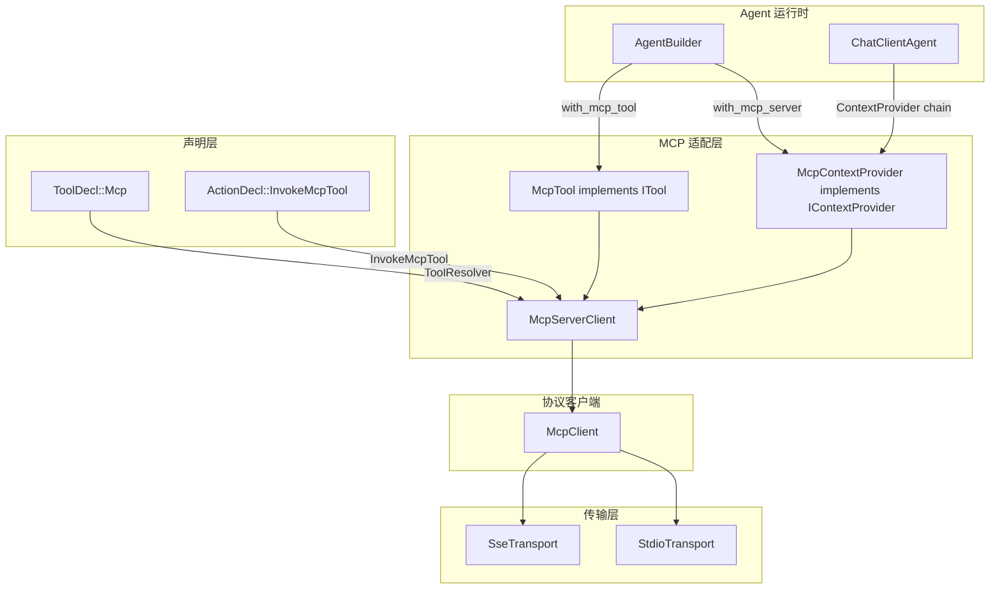

# 12.8 MCP 协议集成

MCP（Model Context Protocol）是面向 AI Agent 的开放协议，定义了 Agent 与外部工具服务器之间的标准化交互方式。通过 `rust-agent-mcp` crate，RAF 可以连接任何兼容 MCP 的工具服务器，将外部工具无缝集成到 Agent 的工具调用循环中。

## MCP 协议概述

MCP 基于 JSON-RPC 2.0，定义了以下核心操作：

| 操作 | 方法 | 说明 |
|------|------|------|
| 初始化 | `initialize` / `initialized` | 客户端/服务器能力协商握手 |
| 工具列表 | `tools/list` | 获取服务器提供的工具列表 |
| 工具调用 | `tools/call` | 执行指定工具 |
| 资源列表 | `resources/list` | 列出可用资源 |
| 资源读取 | `resources/read` | 读取指定资源内容 |
| 提示词列表 | `prompts/list` | 列出可用提示词模板 |
| 提示词获取 | `prompts/get` | 获取指定提示词内容 |

## 架构设计



## 快速开始

### 连接 MCP 服务器

```rust
use rust_agent_mcp::{McpServerClient, McpConnectionOptions, McpContextProvider};
use rust_agent_framework::AgentBuilder;

#[tokio::main]
async fn main() -> anyhow::Result<()> {
    // 1. 连接 MCP 文件系统服务器
    let config = McpConnectionOptions::stdio(
        "mcp-filesystem-server",
        vec!["/workspace".into()],
    );
    let server = McpServerClient::connect(config).await?;

    // 2. 创建 Agent 并注入 MCP 工具
    let agent = AgentBuilder::new("mcp-agent")
        .chat_client(my_chat_client)
        .instructions("You can read and write files via MCP tools.")
        .add_context_provider(McpContextProvider::new(server))
        .build()?;

    // 3. 运行 Agent（MCP 工具会被自动发现和注入）
    let response = agent.run(
        vec![user_message("Read the README.md file")],
        Some(agent.create_session()),
        None,
    ).await?;

    Ok(())
}
```

### 手动工具注册

如果不想用 ContextProvider 的动态发现，也可以直接注册工具：

```rust
let client = Arc::new(McpClient::connect(config).await?);
let tools_result = client.list_tools(None).await?.unwrap();

let mut registry = ToolRegistry::new();
for tool_info in &tools_result.tools {
    let mcp_tool = McpTool::new(Arc::clone(&client), tool_info);
    registry.register(mcp_tool);
}
```

### 资源操作

除了工具，MCP 客户端也支持资源和提示词操作：

```rust
// 列出可用资源
if let Some(resources) = client.list_resources(None).await? {
    for res in &resources.resources {
        println!("Resource: {} ({})", res.name, res.uri);
    }
}

// 读取指定资源
let content = client.read_resource("file:///workspace/config.json").await?;
for item in &content.contents {
    match item {
        ResourceContent::Text { text, .. } => println!("{}", text),
        ResourceContent::Blob { blob, mime_type, .. } => {
            println!("Binary data: {} ({} bytes)", mime_type.as_deref().unwrap_or("unknown"), blob.len());
        }
    }
}

// 获取提示词
let prompt = client.get_prompt("code_review", None).await?;
for msg in &prompt.messages {
    println!("[{}]: {}", 
        match msg.role { PromptMessageRole::User => "User", PromptMessageRole::Assistant => "Assistant" },
        msg.content
    );
}
```

## 传输层详解

### Stdio 传输

Stdio 传输通过启动子进程并与其标准输入/输出通信来与 MCP 服务器交互。这是最常见的方式，适用于本地运行的 MCP 服务器。

**生命周期管理：**
- 子进程在 `connect()` 时启动
- stderr 自动转发到 `tracing::debug!`（target: `mcp_server_stderr`）
- `close()` 时 kill 子进程

**示例：连接各种 MCP 服务器**

```rust
// Node.js 实现的 MCP 服务器
McpConnectionOptions::stdio("npx", vec!["-y", "@modelcontextprotocol/server-filesystem", "/workspace"]);

// Python 实现的 MCP 服务器
McpConnectionOptions::stdio("python", vec!["-m", "my_mcp_server", "--port", "8080"]);

// Go/Rust 编译的 MCP 服务器
McpConnectionOptions::stdio("./mcp-server", vec!["--config", "config.toml"]);
```

### SSE 传输

SSE 传输适用于远程 MCP 服务器，通过 HTTP 进行通信：

- **Client → Server**：HTTP POST JSON-RPC 请求
- **Server → Client**：HTTP SSE（Server-Sent Events）流

```rust
McpConnectionOptions::sse(
    "https://mcp.example.com/sse",         // SSE 端点（接收事件）
    "https://mcp.example.com/messages",    // POST 端点（发送请求）
);
```

## Protocol Version

RAF MCP 客户端实现 MCP 协议版本 `2024-11-05`。如果服务器返回不同的协议版本，会记录警告但不会中止连接。

## Crate 位置

```
crates/mcp/                          # MCP 协议客户端 crate
├── Cargo.toml
└── src/
    ├── lib.rs                       # 入口和重新导出
    ├── types.rs                     # JSON-RPC 2.0 + MCP 协议类型
    ├── transport.rs                 # Transport trait + Stdio/Sse 实现
    ├── client.rs                    # McpClient 连接和协议操作
    ├── tool_adapter.rs              # McpTool (ITool) + McpServerClient
    └── context_provider.rs          # McpContextProvider (IContextProvider)
```

## 相关阅读

- [4.8 MCP 工具集成](../04-tool-system/mcp-tools.md) — MCP 工具作为 ITool 的详细用法
- [4.6 自定义工具开发指南](../04-tool-system/custom-tools.md) — 了解 ITool 接口
- [5.4 自定义上下文提供器](../05-context-providers/custom-provider.md) — 了解 ContextProvider 机制
- [10.3 声明式配置](../10-macros-declarative/declarative-config.md) — 声明式 MCP 工具声明
- [MCP 官方规范](https://modelcontextprotocol.io/) — 完整的 MCP 协议规范
