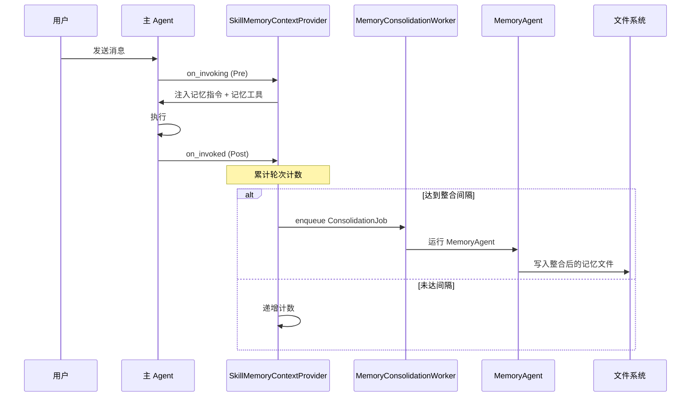

# 12.7 SkillMemory 记忆系统

`SkillMemory` 是 RAF 的持久化跨会话记忆系统。它通过后台 `MemoryConsolidationWorker` 定期触发 `MemoryAgent` 进行记忆整合，并将记忆持久化到文件系统，使 Agent 在多次对话之间保持上下文。

## 架构概览



## SkillMemoryContextProvider

核心上下文提供器，负责：
1. **Pre-invocation**：注入记忆检索指令和工具
2. **Post-invocation**：触发后台记忆整合

```rust
pub struct SkillMemoryContextProvider {
    enabled: bool,
    memory_dir: PathBuf,
    skills_provider: Option<AgentSkillsProvider>,
    memory_agent_client: Option<Arc<dyn IChatClient>>,
    consolidation_interval: usize,       // 整合间隔（默认 3 轮）
    worker: Arc<MemoryConsolidationWorker>,
}
```

### 配置

```rust
let memory = SkillMemoryContextProvider::new("./memory")
    .with_enabled(true)                    // 启用记忆
    .with_memory_agent(memory_client)      // 指定 MemoryAgent 的客户端
    .with_consolidation_interval(5);       // 每 5 轮整合一次
```

### Pre-invocation 注入

每次调用时，`SkillMemoryContextProvider` 向 Agent 注入记忆检索指令：

```rust
fn build_advertise(&self) -> String {
    concat!(
        "## PERSISTENT MEMORY\n\n",
        "You have a persistent, cross-session memory system. Memory files exist even ",
        "when a conversation is brand new — do NOT assume 'no history' just because ",
        "the current conversation just started. Your training data does NOT contain ",
        "these memory files; their contents are the authoritative source.\n\n",
        "**When to retrieve memory (MANDATORY):**\n",
        "- Identity: your name/role, the user's identity, shared goals\n",
        "- Constraints: behavioral rules, user preferences, past lessons\n",
        "- Domain knowledge: professional material previously studied\n\n",
        "**How to retrieve:**\n",
        "1. Call `load_skill(\"skill-memory\")` to get the full retrieval guide.\n",
        "2. Follow that guide to read the correct memory files.\n\n",
        "Do NOT use training-data defaults for any identity-related question."
    )
}
```

### Post-invocation 整合触发

```rust
async fn on_invoked(&self, agent, session, request_messages, response, error) -> Result<()> {
    // 递增轮次计数
    let key = format!("{}_turn_count", self.name());
    let current_count = session.get_provider_state(&key).unwrap_or(0) as usize;
    let new_count = current_count + 1;

    if new_count >= self.consolidation_interval {
        // 重置计数
        session.set_provider_state(&key, Value::Number(0.into()))?;

        // 准备整合消息
        let turn_transcript = response.map(|r| r.turn_transcript.clone()).unwrap_or_default();
        let memory_projection = load_memory_projection(session);
        let consolidation = prepare_consolidation_messages(&memory_projection, &turn_transcript);

        // 保存当前记忆投影
        save_memory_projection(session, &consolidation)?;

        // 入队后台整合任务
        self.worker.enqueue_latest(ConsolidationJob {
            memory_dir: self.memory_dir.clone(),
            client: self.resolve_client(agent)?,
            messages: consolidation,
            session_id: Some(session.session_id().to_string()),
            coalesced_dropped: 0,
        });
    } else {
        session.set_provider_state(&key, Value::Number(new_count.into()))?;
    }

    Ok(())
}
```

## 客户端解析

`SkillMemoryContextProvider` 自动从主 Agent 发现 ChatClient，用于生成 MemoryAgent：

```rust
fn resolve_client(&self, agent: &dyn IAgent) -> Option<Arc<dyn IChatClient>> {
    // 1. 优先使用显式配置的 memory_agent_client
    if let Some(c) = &self.memory_agent_client {
        return Some(Arc::clone(c));
    }

    // 2. 检查缓存的自动发现客户端
    if let Some(c) = &*self.auto_client.lock().unwrap() {
        return Some(Arc::clone(c));
    }

    // 3. 从主 Agent 获取 ChatClient
    let main_client = agent.chat_client()?;

    // 4. 解包装饰器链，获取原始客户端
    let raw = unwrap_to_raw(main_client);

    // 5. 包装为 MemoryAgentChatClient
    let wrapped: Arc<dyn IChatClient> = 
        Arc::new(MemoryAgentChatClient::new(Arc::clone(raw)));

    // 6. 缓存
    *self.auto_client.lock().unwrap() = Some(Arc::clone(&wrapped));

    Some(wrapped)
}
```

## MemoryConsolidationWorker

后台工作线程，负责合并和串行化整合任务：

```rust
pub struct MemoryConsolidationWorker {
    // 内部维护任务队列和处理循环
}

impl MemoryConsolidationWorker {
    pub fn spawn() -> Arc<Self>;
    pub fn enqueue_latest(&self, job: ConsolidationJob);
    pub fn stats(&self) -> WorkerStats;
}
```

使用 `enqueue_latest` 合并策略——如果前一个整合任务尚未完成，新任务会替换旧任务（`coalesced_dropped` 计数递增）。

### WorkerStats 统计

```rust
pub struct WorkerStats {
    pub total_completed: u64,      // 已完成整合数
    pub total_failed: u64,         // 失败整合数
    pub queued: u64,               // 当前队列数
    pub coalesced_dropped: u64,   // 合并丢弃数
}
```

## 记忆目录结构

```
memory/
├── SKILL.md              # 记忆系统的指令文件
├── identity.md           # Agent 身份记忆
├── user.md               # 用户信息记忆
├── preferences.md        # 用户偏好记忆
├── knowledge/            # 领域知识记忆
│   └── ...
├── sessions/             # 会话总结记忆
│   └── ...
└── constraints.md        # 行为约束记忆
```

### 种子初始化

首次使用时，`memory_seed::seed_memory_dir()` 自动创建目录结构和默认文件：

```rust
pub fn seed_memory_dir(memory_dir: &Path) {
    // 创建目录结构
    std::fs::create_dir_all(memory_dir.join("knowledge")).ok();
    std::fs::create_dir_all(memory_dir.join("sessions")).ok();

    // 创建默认 SKILL.md
    write_if_missing(memory_dir.join("SKILL.md"), DEFAULT_SKILL_MD);

    // 创建空记忆文件
    write_if_missing(memory_dir.join("identity.md"), "");
    write_if_missing(memory_dir.join("user.md"), "");
    write_if_missing(memory_dir.join("preferences.md"), "");
    write_if_missing(memory_dir.join("constraints.md"), "");
}
```

## 完整示例

```rust
use rust_agent_framework::{
    AgentBuilder,
    memory::SkillMemoryContextProvider,
};
use std::path::Path;

async fn agent_with_memory() -> anyhow::Result<()> {
    let client = DeepSeekChatClient::new(/* ... */)?;

    // 1. 配置持久记忆
    let memory = SkillMemoryContextProvider::new("./agent_memory")
        .with_consolidation_interval(3); // 每 3 轮对话触发记忆整合

    // 2. 构建 Agent
    let agent = AgentBuilder::new("assistant_with_memory")
        .chat_client(client)
        .instructions("你是个人 AI 助手。使用 load_skill('skill-memory') 查看记忆检索指南。")
        .with_context_provider(memory)
        .with_tool(ReadFile::default())
        .with_tool(WriteFile::default())
        .max_tool_rounds(10)
        .build()?;

    // 3. 第一轮对话
    let input1 = vec![ChatMessage::user("我叫张三，是一名 Rust 开发者。")];
    agent.run(input1, None, None).await?;

    // 4. 第二轮对话
    let input2 = vec![ChatMessage::user("我喜欢简洁的代码风格。")];
    agent.run(input2, None, None).await?;

    // 5. 第三轮对话（触发记忆整合）
    let input3 = vec![ChatMessage::user("请记住我的偏好。")];
    agent.run(input3, None, None).await?;

    // 等待后台整合完成（生产环境中由 Worker 异步处理）
    tokio::time::sleep(Duration::from_secs(5)).await;

    // 6. 新会话 — Agent 应该能从记忆中回忆用户信息
    let input4 = vec![ChatMessage::user("我叫什么名字？我的编程偏好是什么？")];
    let mut stream = agent.run(input4, None, None).await?;
    // Agent 应从 memory 目录读取 identity.md 和 preferences.md

    Ok(())
}
```

## 注意事项

1. **异步整合**：记忆整合是异步后台任务，写入可能在几秒到几十秒后完成
2. **客户端解包**：`unwrap_to_raw` 会递归展开装饰器链以获取原始 ChatClient
3. **文件锁安全**：`MemoryAgent` 使用独立的文件写入逻辑，避免与主 Agent 冲突
4. **token 消耗**：每次对话前会注入 ~200 tokens 的记忆检索指令
5. **整合频率**：默认每 3 轮触发整合，可通过 `with_consolidation_interval()` 调整
6. **合并策略**：使用 `enqueue_latest` 而非 FIFO 队列，避免积压
