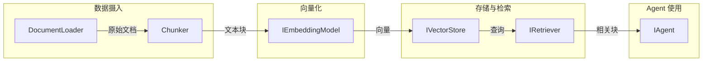

# 12.3 检索增强生成（RAG）

`rust-agent-rag` 提供了完整的 RAG（Retrieval-Augmented Generation）管道抽象，包括文档加载、智能分块、嵌入向量化、向量存储和语义检索。框架不绑定特定实现，通过 trait 抽象允许替换任意组件。

## RAG 管道架构



## 核心 Trait

### DocumentLoader — 文档加载器

负责从各种来源加载文档：

```rust
pub trait DocumentLoader: Send + Sync {
    /// 加载文档并返回结构化内容
    async fn load(&self, source: &str) -> Result<Document>;

    /// 支持的来源类型（file, url, text 等）
    fn supported_sources(&self) -> Vec<&str>;
}
```

### Chunker — 文档分块器

将长文档智能分割为适合嵌入的文本块：

```rust
pub trait Chunker: Send + Sync {
    /// 将文档分割为文本块
    fn chunk(&self, document: &Document) -> Result<Vec<Chunk>>;

    /// 分块策略名称
    fn strategy(&self) -> &str;
}
```

支持的分块策略：

| 策略 | 原理 | 适用场景 |
|------|------|---------|
| **Recursive** | 按段落→句子→词递归分割 | 通用文档 |
| **Semantic** | 基于语义边界分割 | 技术文档 |
| **Fixed-size** | 固定 token 数分割 | 简单场景 |
| **Markdown-aware** | 识别 Markdown 标题结构 | Markdown 文档 |

### IEmbeddingModel — 嵌入模型

```rust
pub trait IEmbeddingModel: Send + Sync {
    /// 将文本转换为向量
    async fn embed(&self, texts: &[String]) -> Result<Vec<Vec<f32>>>;

    /// 模型的向量维度
    fn dimension(&self) -> usize;

    /// 模型标识符
    fn model_id(&self) -> &str;
}
```

### IVectorStore — 向量存储

```rust
pub trait IVectorStore: Send + Sync {
    /// 存储向量及其元数据
    async fn store(&self, chunks: Vec<StoredChunk>) -> Result<()>;

    /// 按向量相似度搜索
    async fn search(
        &self,
        query_vector: &[f32],
        top_k: usize,
    ) -> Result<Vec<ScoredChunk>>;

    /// 删除指定文档的所有块
    async fn delete(&self, document_id: &str) -> Result<()>;
}
```

### IRetriever — 检索器

```rust
pub trait IRetriever: Send + Sync {
    /// 根据查询文本检索相关块
    async fn retrieve(
        &self,
        query: &str,
        top_k: usize,
    ) -> Result<Vec<RetrievedChunk>>;
}
```

## 完整 RAG 管道示例

```rust
use rust_agent_rag::{
    DocumentLoader, Chunker, IEmbeddingModel, IVectorStore, IRetriever,
};

async fn build_rag_pipeline() -> anyhow::Result<()> {
    // 1. 加载文档
    let loader = MyDocumentLoader::new();
    let document = loader.load("./docs/technical_manual.md").await?;
    println!("文档已加载: {} 字符", document.content.len());

    // 2. 分块
    let chunker = RecursiveChunker::new()
        .with_chunk_size(512)      // 每块 512 tokens
        .with_chunk_overlap(50);   // 块间重叠 50 tokens

    let chunks = chunker.chunk(&document)?;
    println!("分割为 {} 个文本块", chunks.len());

    // 3. 嵌入向量化
    let embedding_model = MyEmbeddingModel::new("text-embedding-3-small");
    let texts: Vec<String> = chunks.iter().map(|c| c.text.clone()).collect();
    let vectors = embedding_model.embed(&texts).await?;
    println!("生成 {} 个向量 (维度: {})", vectors.len(), embedding_model.dimension());

    // 4. 存储到向量库
    let vector_store = MyVectorStore::connect("redis://localhost:6379").await?;
    let stored_chunks: Vec<StoredChunk> = chunks.iter()
        .zip(vectors.iter())
        .map(|(chunk, vector)| StoredChunk {
            id: chunk.id.clone(),
            document_id: document.id.clone(),
            text: chunk.text.clone(),
            vector: vector.clone(),
            metadata: chunk.metadata.clone(),
        })
        .collect();

    vector_store.store(stored_chunks).await?;
    println!("已存储到向量库");

    // 5. 检索
    let retriever = DefaultRetriever::new(embedding_model, vector_store);
    let results = retriever.retrieve("Rust async trait 如何定义?", 5).await?;

    println!("检索结果:");
    for (i, chunk) in results.iter().enumerate() {
        println!("{}. [分数: {:.4}] {}", i + 1, chunk.score, 
            &chunk.text[..100.min(chunk.text.len())]);
    }

    // 6. 构建上下文注入 Agent
    let context = results.iter()
        .map(|c| format!("---\n来源: {}\n\n{}", 
            c.metadata.get("source").unwrap_or(&"unknown".to_string()),
            c.text))
        .collect::<Vec<_>>()
        .join("\n\n");

    Ok(())
}
```

## 分块策略详解

### RecursiveChunker 递归分块

```rust
pub struct RecursiveChunker {
    chunk_size: usize,         // 目标块大小（tokens）
    chunk_overlap: usize,      // 块间重叠（tokens）
    separators: Vec<String>,   // 分隔符优先级：["\n\n", "\n", "。", ".", " ", ""]
}
```

分块过程：
1. 尝试使用最高优先级分隔符（段落分隔 `\n\n`）分割
2. 如果某段超过 `chunk_size`，使用下一级分隔符
3. 递归直到使用字符级分割（空字符串）
4. 相邻块保留 `chunk_overlap` tokens 的重叠

### SemanticChunker 语义分块

```rust
pub struct SemanticChunker {
    similarity_threshold: f32,  // 语义断点阈值（默认 0.7）
    min_chunk_size: usize,      // 最小块大小
    max_chunk_size: usize,      // 最大块大小
}
```

使用嵌入相似度检测语义边界：
1. 计算相邻句子的嵌入向量
2. 当相似度低于阈值时标记为断点
3. 在断点处分割，确保块在 min/max 范围内

## 与 Agent 集成

### 构建 RAG 工具

```rust
use rust_agent_macros::tool;

#[tool(description = "从知识库中检索相关信息")]
async fn search_knowledge_base(
    #[param(desc = "搜索查询")] query: String,
    #[param(desc = "最大结果数")] top_k: Option<i64>,
) -> rust_agent_core::ToolResult {
    let retriever = get_global_retriever();
    let results = retriever.retrieve(
        &query,
        top_k.unwrap_or(5) as usize,
    ).await.map_err(|e| /* ... */)?;

    let formatted = results.iter()
        .enumerate()
        .map(|(i, c)| format!("[{}] (相关度: {:.2})\n{}", i + 1, c.score, c.text))
        .collect::<Vec<_>>()
        .join("\n\n");

    rust_agent_core::ToolResult::success(serde_json::json!({
        "results": formatted,
        "count": results.len(),
    }))
}

// 注册到 Agent
let agent = AgentBuilder::new("rag_agent")
    .chat_client(client)
    .instructions("你可以使用 search_knowledge_base 工具检索内部知识库。")
    .with_tool(SearchKnowledgeBase)
    .build()?;
```

### 使用 ContextProvider 自动注入

```rust
struct RAGContextProvider {
    retriever: Arc<dyn IRetriever>,
}

#[async_trait]
impl IContextProvider for RAGContextProvider {
    async fn on_invoking(
        &self,
        _agent: &dyn IAgent,
        _session: &dyn ISession,
        messages: &[ChatMessage],
        _options: &AgentRunOptions,
    ) -> Result<ContextResult> {
        // 从最后一条用户消息中提取查询
        let last_user_msg = messages.iter()
            .rev()
            .find(|m| m.role == "user")
            .map(|m| m.content());

        if let Some(query) = last_user_msg {
            let results = self.retriever.retrieve(&query, 3).await?;
            let context = format_context(results);
            return Ok(ContextResult {
                instructions: Some(format!(
                    "以下是相关知识库内容，请基于这些内容回答问题:\n\n{}",
                    context
                )),
                ..Default::default()
            });
        }

        Ok(ContextResult::default())
    }
}
```

## 注意事项

1. **嵌入模型选择**：需要自行集成嵌入模型（如 OpenAI text-embedding-3-small、本地模型等）
2. **向量存储后端**：需要自行选择向量存储（Redis、Qdrant、Milvus、FAISS 等）
3. **chunk_size 调优**：过小丢失上下文，过大降低检索精度。推荐 512-1024 tokens
4. **chunk_overlap 设置**：推荐 chunk_size 的 10-15%，确保跨块上下文连续性
5. **分块策略选择**：通用文档用 RecursiveChunker，技术文档用 SemanticChunker
