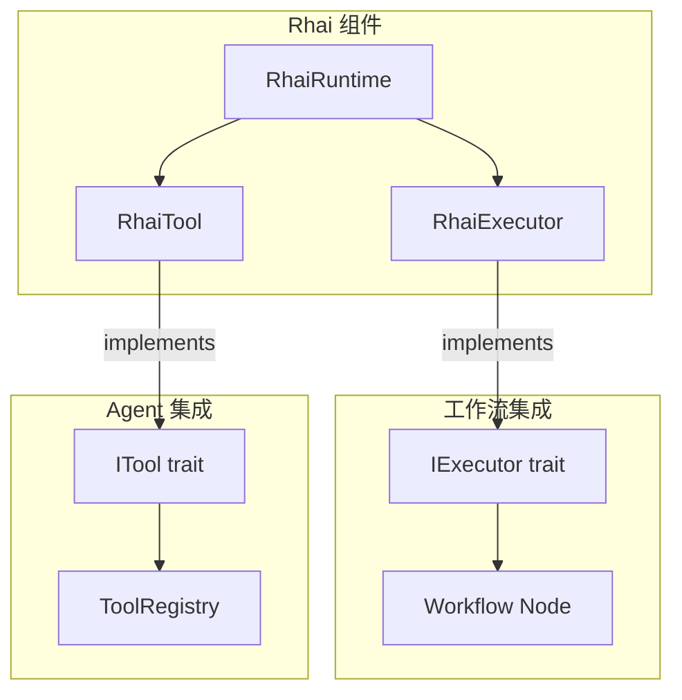

# 12.6 Rhai 脚本引擎

`rust-agent-rhai` 将 Rhai 嵌入式脚本语言集成到 RAF 框架中，提供三种使用模式：`RhaiRuntime`（独立运行时）、`RhaiExecutor`（工作流节点执行器）和 `RhaiTool`（Agent 工具）。

## 架构概览



## RhaiRuntime — 独立运行时

`RhaiRuntime` 是 Rhai 脚本引擎的核心封装，提供沙箱化执行环境：

```rust
use rust_agent_rhai::RhaiRuntime;
use rhai::Dynamic;

let mut runtime = RhaiRuntime::new();

// 注入变量
runtime.with_variable("threshold", Dynamic::from(42_i64));
runtime.with_json_variable("config", serde_json::json!({
    "mode": "production",
    "max_retries": 3
}));

// 设置并编译脚本
runtime.with_script(r#"
    let count = 0;
    let results = [];
    for item in config.items {
        if item.score > threshold {
            count += 1;
            results.push(item.name);
        }
    }
    #{count: count, high_scorers: results}
"#);

// 执行脚本
let result = runtime.run()?;
println!("结果: {:?}", result);
```

### 核心功能

| 功能 | 方法 | 说明 |
|------|------|------|
| 编译脚本 | `with_script(src)` | 设置并编译 Rhai 源代码 |
| 注入变量 | `with_variable(name, value)` | 注入 Dynamic 类型变量 |
| JSON 变量 | `with_json_variable(name, value)` | 注入 serde_json::Value（自动转换） |
| 注册模块 | `with_module(name, module)` | 注册自定义 Rhai 模块 |
| 注册类型 | `register_type::<T>()` | 注册自定义类型 |
| 执行脚本 | `run()` | 运行预编译脚本，返回 JSON |
| 一步执行 | `eval(script)` | 编译 + 执行一步完成 |
| 表达式求值 | `eval_expression(expr)` | 求值单个表达式，返回 Dynamic |
| 获取变量 | `get_variable(name)` | 从作用域中读取变量 |

### 沙箱安全

`RhaiRuntime` 使用 `Engine::new_raw()` 创建沙箱化引擎，默认禁用危险的 `eval` 函数：

```rust
let mut runtime = RhaiRuntime::new();

// 以下脚本会执行失败（eval 被禁用）
runtime.with_script("eval(\"42\")");
let result = runtime.run();
assert!(result.is_err()); // 沙箱阻止了 eval 调用
```

操作限制默认设为 100,000 次，可通过 `max_operations()` 调整：

```rust
runtime.max_operations(1_000_000); // 提高限制
```

## RhaiExecutor — 工作流节点执行器

`RhaiExecutor` 将 Rhai 脚本适配为工作流的 `IExecutor`，可以直接作为工作流图的节点使用：

```rust
use rust_agent_rhai::RhaiExecutor;
use rust_agent_workflow::WorkflowBuilder;

let executor = RhaiExecutor::new(
    "data_transformer",     // 执行器 ID
    r#"
        // 输入变量: input (绑定为上游消息)
        // 上下文变量: node_id, context, _meta
        // 回调函数: emit_text(), emit_custom(), set_output()

        let transformed = #{
            original: input.data,
            processed: input.data.to_upper(),
            timestamp: _meta.node_id,
        };

        emit_text("数据转换完成");
        set_output("last_result", transformed.processed);

        transformed
    "#,
    "input",               // 输入变量绑定名称
);

// 用于工作流图
let mut builder = WorkflowBuilder::new("data_pipeline");
builder.add_node("transform", executor, "数据转换");
```

### 脚本内置变量

| 变量 | 类型 | 说明 |
|------|------|------|
| `input` (或自定义名) | Dynamic | 上游节点的输出消息 |
| `node_id` | String | 当前执行节点的 ID |
| `context` | Map | 当前工作流上下文状态快照 |
| `_meta` | Map | 执行元信息（node_id 等） |

### 脚本回调函数

| 函数 | 说明 |
|------|------|
| `emit_text(msg)` | 发送流式文本进度事件 |
| `emit_custom(key, value)` | 发送自定义进度事件 |
| `set_output(key, value)` | 回写状态到工作流上下文 |

### 执行流程

```rust
#[async_trait]
impl IExecutor for RhaiExecutor {
    async fn handle(
        &self,
        message: Arc<dyn Any + Send + Sync>,
        ctx: &dyn IWorkflowContext,
        progress: UnboundedSender<NodeProgress>,
    ) -> Result<HandlerResult> {
        // 1. 提取输入数据
        let input_value = extract_input(message);

        // 2. 加载上下文快照
        let context_snapshot = load_context_snapshot(ctx).await?;

        // 3. 注入变量和回调，执行脚本
        let mut runtime = self.runtime.lock();
        runtime.with_json_variable(&self.input_var, input_value);
        runtime.scope_mut().push("node_id", node_id.clone());
        runtime.with_json_variable("context", context_snapshot);
        runtime.with_json_variable("_meta", serde_json::json!({
            "node_id": node_id,
        }));

        // 注册进度回调
        runtime.engine_mut().register_fn("emit_text", move |msg: &str| {
            let _ = progress.send(NodeProgress::TextDelta(msg.to_string()));
        });
        runtime.engine_mut().register_fn("set_output", move |key: &str, value: &str| {
            let val = serde_json::from_str::<Value>(value).unwrap_or(Value::String(value.into()));
            output_writes.lock().push((key.to_string(), val));
        });

        let result = runtime.run()?;

        // 4. 回写 output_writes 到上下文
        // 5. 返回 HandlerResult
        Ok(HandlerResult::Messages(vec![Arc::new(result)]))
    }
}
```

## RhaiTool — Agent 工具

`RhaiTool` 将 Rhai 脚本封装为 `ITool`，使 Agent 可以通过 function calling 调用：

```rust
use rust_agent_rhai::RhaiTool;
use rust_agent_core::ITool;

let tool = RhaiTool::new(
    "calculate_discount",       // 工具名称
    "计算订单折扣金额",           // 工具描述
    serde_json::json!({         // JSON Schema
        "type": "object",
        "properties": {
            "order_total": {"type": "number", "description": "订单总金额"},
            "customer_level": {"type": "string", "description": "客户等级: bronze/silver/gold"}
        },
        "required": ["order_total", "customer_level"]
    }),
    r#"                          // Rhai 脚本
        let rates = #{
            bronze: 0.05,
            silver: 0.10,
            gold: 0.20,
        };
        let rate = rates[args.customer_level] ?? 0.0;
        let discount = args.order_total * rate;
        #{
            original: args.order_total,
            rate: rate,
            discount: discount,
            final: args.order_total - discount,
        }
    "#,
);

// 注册到 Agent
let agent = AgentBuilder::new("sales")
    .chat_client(client)
    .with_tool(tool)
    .build()?;
```

### 创建选项

| 方法 | 说明 |
|------|------|
| `RhaiTool::new(name, desc, schema, script)` | 标准创建 |
| `RhaiTool::with_runtime(name, desc, schema, runtime, script)` | 使用预配置的 Runtime |
| `RhaiTool::from_script_file(name, desc, schema, path)` | 从文件加载 `.rhai` 脚本 |

### 脚本内置变量

| 变量 | 说明 |
|------|------|
| `args` | Agent 传入的工具参数（JSON 对象） |

## 完整示例

```rust
use rust_agent_rhai::RhaiTool;
use rust_agent_framework::AgentBuilder;
use futures_util::StreamExt;

async fn rhai_augmented_agent() -> anyhow::Result<()> {
    let client = DeepSeekChatClient::new(/* ... */)?;

    // 自定义计算工具（Rhai 脚本）
    let stats_tool = RhaiTool::new(
        "calculate_statistics",
        "计算数据集的基本统计信息",
        serde_json::json!({
            "type": "object",
            "properties": {
                "numbers": {
                    "type": "array",
                    "items": {"type": "number"},
                    "description": "数字数组"
                }
            },
            "required": ["numbers"]
        }),
        r#"
            let nums = args.numbers;
            let count = nums.len();
            if count == 0 {
                return #{error: "数据集为空"};
            }

            let sum = 0.0;
            for n in nums { sum += n; }
            let mean = sum / count;

            // 排序后计算中位数
            nums.sort();
            let median = if count % 2 == 1 {
                nums[count / 2]
            } else {
                (nums[count / 2 - 1] + nums[count / 2]) / 2.0
            };

            // 标准差
            let variance = 0.0;
            for n in nums { variance += (n - mean) * (n - mean); }
            let std_dev = (variance / count).sqrt();

            #{
                count: count,
                sum: sum,
                mean: mean,
                median: median,
                std_dev: std_dev,
                min: nums[0],
                max: nums[count - 1],
            }
        "#,
    );

    let agent = AgentBuilder::new("analyst")
        .chat_client(client)
        .instructions("你是数据分析师。使用 calculate_statistics 处理数据。")
        .with_tool(stats_tool)
        .build()?;

    let input = vec![ChatMessage::user(
        "请分析这组数据的统计特征: [23, 45, 12, 67, 34, 89, 15, 56, 78, 41]"
    )];

    let mut stream = agent.run(input, None, None).await?;
    while let Some(chunk) = stream.next().await {
        if let Ok(result) = chunk {
            for content in &result.contents {
                if let rust_agent_core::Content::Text(ref t) = content {
                    print!("{}", t.delta);
                }
            }
        }
    }

    Ok(())
}
```

## JSON ↔ Dynamic 转换

RhaiRuntime 内置了 serde_json::Value 和 rhai::Dynamic 之间的双向转换：

```rust
// JSON → Dynamic
let json = serde_json::json!({"name": "test", "count": 42, "items": [1, 2, 3]});
let dynamic = json_to_dynamic_val(&json);

// Dynamic → JSON
let back = dynamic_to_json_val(&dynamic);
assert_eq!(json, back); // 完美往返
```

## 注意事项

1. **性能开销**：Rhai 脚本每次执行都会重新注入变量，对于高频调用的工具建议使用原生 Rust 实现
2. **沙箱限制**：`Engine::new_raw()` 禁用了文件 I/O、网络等危险操作，适合执行不受信任的脚本
3. **错误处理**：脚本编译和执行错误都会被转换为 `AgentError::WorkflowError`
4. **操作限制**：默认 100,000 次操作，可防止无限循环，但复杂脚本可能需要提高此限制
5. **类型安全**：Rhai 是动态类型语言，类型错误在运行时而非编译期发现
