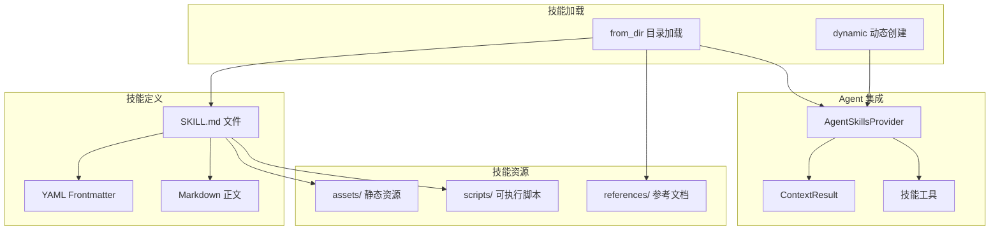

# 12.5 Agent 技能系统

RAF 的技能系统允许将可复用的 Agent 能力打包为标准的 `SKILL.md` 格式，支持动态创建和从目录加载。

## 技能架构



## AgentSkill 类型

```rust
#[derive(Clone)]
pub struct AgentSkill {
    pub metadata: SkillMetadata,
    root_dir: Option<PathBuf>,                     // from_dir 时设置
    instructions: Option<String>,                  // dynamic 时设置
    resources: HashMap<String, Vec<u8>>,           // 内联资源
}
```

### SkillMetadata — 技能元信息

```rust
#[derive(Debug, Clone, Default)]
pub struct SkillMetadata {
    pub name: String,                              // 技能名称
    pub description: String,                       // 技能描述
    pub license: Option<String>,                   // 许可证
    pub compatibility: Option<String>,             // 兼容性说明
    pub metadata: HashMap<String, String>,         // 自定义元数据
}
```

## SKILL.md 格式

每个技能目录下必须有一个 `SKILL.md` 文件，包含 YAML frontmatter 和 Markdown 正文：

```markdown
---
name: code-review
description: Review code for quality, security, and best practices
license: MIT
compatibility: Any
metadata:
  author: team-platform
  version: "1.2.0"
  category: development
---

# 代码审查技能

## 职责
你是一个经验丰富的代码审查员。当你被激活时，请遵循以下流程：

1. **理解代码**：阅读并理解待审查的代码
2. **检查结构**：评估代码组织、命名和架构
3. **安全审查**：识别潜在的安全漏洞
4. **性能分析**：指出性能瓶颈
5. **最佳实践**：检查是否符合语言和框架的最佳实践

## 输出格式
```markdown
## 代码审查报告

### 总体评分：X/10

### 优点
- ...

### 问题
- [严重] ...
- [警告] ...

### 建议
- ...
```
```

## 技能目录结构

```
skills/
└── code-review/
    ├── SKILL.md              # 技能定义（必需）
    ├── references/
    │   ├── style-guide.md    # 参考文档（可选）
    │   └── security-checklist.md
    ├── assets/
    │   └── review-template.json  # 静态资源（可选）
    └── scripts/
        └── lint-check.sh     # 可执行脚本（可选）
```

## 加载方式

### from_dir — 从目录加载

```rust
use rust_agent_framework::context_providers::agent_skill::AgentSkill;

// 从文件系统加载技能
let skill = AgentSkill::from_dir("./skills/code-review")?;

println!("技能名称: {}", skill.metadata.name);
println!("技能描述: {}", skill.metadata.description);

// 获取完整的技能指令
let instructions = skill.load_instructions()?;

// 读取参考资源
let style_guide = skill.read_resource("references/style-guide.md")?;

// 检查资源
if skill.has_resources() {
    println!("技能包含参考资源");
}
if skill.has_scripts() {
    println!("技能包含可执行脚本");
}
```

### dynamic — 动态创建

适用于从数据库、远程 API 或其他非文件系统来源加载技能：

```rust
let metadata = SkillMetadata {
    name: "database-query".into(),
    description: "生成和优化 SQL 查询".into(),
    license: Some("MIT".into()),
    ..Default::default()
};

let skill = AgentSkill::dynamic(metadata, r#"
# SQL 查询生成技能

## 原则
1. 始终使用参数化查询
2. 添加适当的索引提示
3. 限制结果集大小
"#)
.with_resource("examples/query.sql", b"SELECT * FROM users WHERE id = ?")
.with_resource("examples/join.sql", b"SELECT u.*, o.total FROM users u JOIN orders o ON u.id = o.user_id");

println!("技能名称: {}", skill.metadata.name);
assert!(skill.has_resources());
```

## AgentSkillsProvider — Agent 集成

`AgentSkillsProvider` 是技能与 Agent 之间的桥梁，作为 `IContextProvider` 将技能注入 Agent：

```rust
use rust_agent_framework::context_providers::skills_provider::AgentSkillsProvider;

// 创建技能提供器
let skills_provider = AgentSkillsProvider::new()
    .with_skill(code_review_skill)
    .with_skill(testing_skill)
    .with_skill(deployment_skill);

// 注册到 Agent
let agent = AgentBuilder::new("multi_skill_agent")
    .chat_client(client)
    .instructions("你可以使用已加载的技能来完成任务。")
    .with_context_provider(skills_provider)
    .build()?;
```

`AgentSkillsProvider` 在每次 Agent 调用时：
1. 将每个技能的 `SKILL.md` 正文注入到 system prompt
2. 注册 `load_skill`、`read_skill_resource`、`run_skill_script` 三个工具
3. 使 Agent 能够动态加载和使用技能

### 技能相关工具

| 工具 | 用途 |
|------|------|
| `load_skill(name)` | 加载指定技能的指令内容 |
| `read_skill_resource(skill, path)` | 读取技能的资源文件 |
| `run_skill_script(skill, script, args)` | 执行技能目录下的脚本 |

## 完整示例

```rust
use rust_agent_framework::{
    AgentBuilder,
    context_providers::{
        agent_skill::AgentSkill,
        skills_provider::AgentSkillsProvider,
    },
};
use futures_util::StreamExt;

async fn skill_based_agent() -> anyhow::Result<()> {
    let client = DeepSeekChatClient::new(/* ... */)?;

    // 1. 从文件系统加载技能
    let code_review = AgentSkill::from_dir("./skills/code-review")?;
    let security_audit = AgentSkill::from_dir("./skills/security-audit")?;

    // 2. 动态创建技能
    let deployment = AgentSkill::dynamic(
        SkillMetadata {
            name: "deployment".into(),
            description: "应用程序部署流程".into(),
            ..Default::default()
        },
        "你是部署专家。执行以下步骤: 1) 验证构建产物 2) 运行健康检查 3) 滚动更新 4) 监控指标",
    );

    // 3. 创建技能提供器
    let skills = AgentSkillsProvider::new()
        .with_skill(code_review)
        .with_skill(security_audit)
        .with_skill(deployment);

    // 4. 构建 Agent
    let agent = AgentBuilder::new("devops_agent")
        .chat_client(client)
        .instructions(
            "你是 DevOps 工程师。可以使用 load_skill 加载相关技能来完成任务。"
        )
        .with_context_provider(skills)
        .with_tool(RunCommand::default())
        .with_tool(ReadFile::default())
        .build()?;

    // 5. 运行
    let input = vec![ChatMessage::user(
        "请审查 src/ 目录下的代码，并给出安全和部署建议。"
    )];

    let mut stream = agent.run(input, None, None).await?;
    while let Some(chunk) = stream.next().await {
        if let Ok(result) = chunk {
            for content in &result.contents {
                if let rust_agent_core::Content::Text(ref t) = content {
                    print!("{}", t.delta);
                }
            }
        }
    }

    Ok(())
}
```

## 路径守卫

Agent 读取技能资源文件时使用统一的路径守卫：

```rust
// read_resource 内部使用 path_guard 进行安全检查
pub(crate) fn read_resource(&self, resource_path: &str) -> Result<String> {
    let root = self.root_dir.as_ref().ok_or(/* ... */)?;

    // 路径守卫：确保解析后的路径在技能根目录内
    let (resolved, _scope) = 
        crate::tools::path_guard::resolve_safe(root, resource_path, None)?;

    std::fs::read_to_string(&resolved).map_err(/* ... */)
}
```

这确保了 Agent 无法通过路径遍历攻击读取技能目录之外的文件。

## 注意事项

1. **SKILL.md 必需**：`from_dir()` 要求目录下存在 `SKILL.md` 文件
2. **Frontmatter 解析**：目前仅支持简单的 YAML key: value 格式，不支持嵌套结构
3. **资源路径**：资源读取受路径守卫保护，不能访问技能根目录外的文件
4. **技能大小**：大型技能（如几 MB 的 SKILL.md）会显著增加每次调用的 token 消耗
5. **动态 vs 目录**：动态技能适用于程序化生成的内容，目录技能适用于版本控制的文件存储
