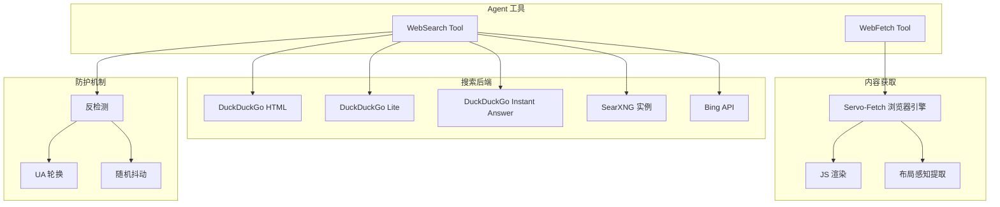

# 12.2 网络搜索（WebSearch / WebFetch）

`rust-agent-websearch` 是一个纯 Rust 实现的网络搜索库，提供 WebSearch 工具（搜索引擎查询）、WebFetch 工具（网页内容获取）和自动搜索上下文提供器。无需 API Key，开箱即用。

## 架构概览



## WebSearch 工具

`WebSearch` 实现 `ITool`，可以作为 Agent 工具直接使用：

```rust
use rust_agent_websearch::WebSearch;
use rust_agent_core::ITool;

let tool = WebSearch;

assert_eq!(tool.name(), "web_search");
assert_eq!(tool.description(), "搜索互联网获取最新信息");

// Agent 调用时
let result = tool.execute(serde_json::json!({
    "query": "Rust async programming best practices"
})).await?;
```

### 多后端支持

WebSearch 支持多种搜索后端，通过 feature flags 切换：

| 后端 | 特点 | 是否需要 API Key |
|------|------|-----------------|
| DuckDuckGo HTML | 默认后端，HTML 抓取 | ❌ |
| DuckDuckGo Lite | 轻量版，更快但结果较少 | ❌ |
| DuckDuckGo Instant Answer | 即时答案 API | ❌ |
| SearXNG | 自托管元搜索引擎 | ❌ (自建实例) |
| Bing API | Microsoft Bing | ✅ |

### 反检测机制

为了确保稳定运行，内置了以下反检测策略：

- **User-Agent 轮换**：使用 `rand` crate 从预定义的 UA 池中随机选择
- **请求抖动**：在请求之间插入随机延迟
- **HTML 解析**：使用 `scraper` crate 进行 CSS 选择器解析，避免正则匹配

```rust
// 反检测策略（内部实现）
use rand::Rng;

fn rotate_user_agent() -> &'static str {
    let agents = [
        "Mozilla/5.0 (Windows NT 10.0; Win64; x64) ...",
        "Mozilla/5.0 (Macintosh; Intel Mac OS X 10_15_7) ...",
        "Mozilla/5.0 (X11; Linux x86_64) ...",
    ];
    agents[rand::thread_rng().gen_range(0..agents.len())]
}
```

## WebFetch 工具

`WebFetch` 使用基于 Servo 的浏览器引擎获取网页内容，支持 JS 渲染和布局感知的内容提取：

```rust
use rust_agent_websearch::WebFetch;

let tool = WebFetch;
let result = tool.execute(serde_json::json!({
    "url": "https://example.com/article",
    "mode": "cleaned"  // 内容清洗模式
})).await?;
```

### 内容清洗模式

| 模式 | 说明 |
|------|------|
| `raw` | 原始 HTML |
| `cleaned` | 移除脚本、样式、导航等非内容元素 |
| `readability` | 类 Readability 算法提取正文 |
| `markdown` | 转换为 Markdown 格式 |
| `plaintext` | 纯文本提取 |

### Servo-Fetch 引擎

`servo-fetch` 提供了完整的浏览器渲染能力：

- 执行 JavaScript 渲染单页应用（SPA）
- 布局感知的内容提取（过滤导航、广告、页脚）
- HTML 净化（移除 script、style、iframe 标签）

## WebSearchContextProvider — 自动搜索

除了手动工具调用，还提供了自动搜索上下文提供器：

```rust
use rust_agent_websearch::{WebSearchContextProvider, WebSearch};

let provider = WebSearchContextProvider::new(WebSearch::default());

// 注册到 Agent
let agent = AgentBuilder::new("researcher")
    .chat_client(client)
    .instructions("...")
    .with_context_provider(provider)
    .build()?;
```

`WebSearchContextProvider` 在每次 Agent 调用前：
1. 分析用户消息中是否包含需要搜索的意图
2. 自动执行搜索
3. 将搜索结果作为上下文注入 system prompt

## 完整示例

```rust
use std::sync::Arc;
use rust_agent_core::{IAgent, ChatMessage};
use rust_agent_websearch::{WebSearch, WebFetch};
use rust_agent_framework::AgentBuilder;
use futures_util::StreamExt;

async fn research_agent() -> anyhow::Result<()> {
    let client = DeepSeekChatClient::new(/* ... */)?;

    let agent = AgentBuilder::new("researcher")
        .chat_client(client)
        .instructions(
            "你是网络研究助手。使用 web_search 搜索信息，使用 web_fetch 获取网页详情。\n\
             原则：\n\
             1. 优先搜索获取最新信息\n\
             2. 对重要来源使用 web_fetch 深入阅读\n\
             3. 引用来源 URL\n\
             4. 注明信息发布时间"
        )
        .with_tool(WebSearch)
        .with_tool(WebFetch)
        .max_tool_rounds(10)
        .build()?;

    let input = vec![ChatMessage::user(
        "请研究 Rust 在 2025 年的生态系统发展情况，包括最新版本特性、\
         热门 crate 和社区动态。"
    )];

    let mut stream = agent.run(input, None, None).await?;

    while let Some(chunk) = stream.next().await {
        if let Ok(result) = chunk {
            for content in &result.contents {
                if let rust_agent_core::Content::Text(ref t) = content {
                    print!("{}", t.delta);
                }
            }
        }
    }

    Ok(())
}
```

## Feature Flags

```toml
[dependencies]
rust-agent-websearch = { version = "0.1", features = ["rustls-tls"] }

# 或使用 native-tls
rust-agent-websearch = { version = "0.1", features = ["native-tls"] }
```

| Feature | 说明 |
|---------|------|
| `rustls-tls` (默认) | 使用 rustls TLS 后端 |
| `native-tls` | 使用平台原生 TLS |

## 注意事项

1. **搜索频率限制**：高频搜索可能触发搜索引擎的限流机制
2. **结果缓存**：目前不包含内置缓存，重复搜索同一查询会重新请求
3. **SearXNG 实例**：使用 SearXNG 后端时需要自行部署或指定公开实例
4. **Servo 依赖**：WebFetch 依赖 `servo-fetch`，这是较重的依赖，仅在需要 JS 渲染时必要
5. **内容大小限制**：WebFetch 获取的页面内容可能被截断，大型页面建议指定 `mode: "readability"` 仅提取正文
