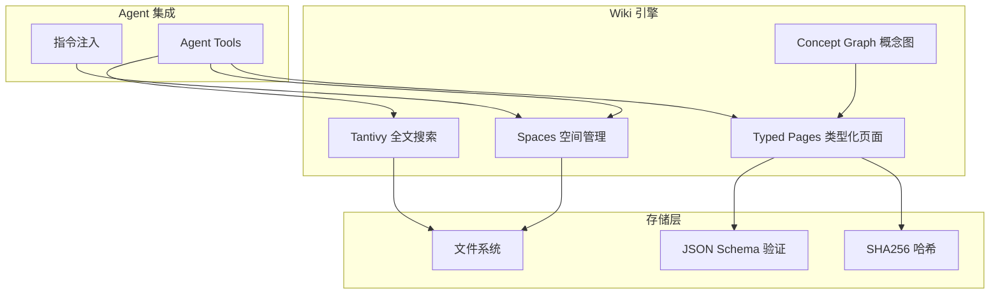

# 12.4 Wiki 知识引擎

`rust-agent-wiki` 是一个基于文件系统的 Wiki 引擎，提供类型化页面、全文搜索（Tantivy）、概念图（Petgraph + Louvain）和 Agent 集成能力。

## 架构概览



## 核心概念

### Spaces（空间）

Wiki 中最高级别的组织单元，类似于项目或命名空间。每个 Space 是一个独立的目录：

```
wiki/
├── rust-knowledge/
│   ├── _space.yaml        # Space 元数据
│   ├── async-programming/  # Typed Page 目录
│   │   ├── _page.yaml     # Page 元数据
│   │   └── content.md     # Page 内容
│   └── error-handling/
│       ├── _page.yaml
│       └── content.md
└── design-patterns/
    ├── _space.yaml
    └── ...
```

### Typed Pages（类型化页面）

每个页面可以声明类型，支持 JSON Schema 验证：

```yaml
# _page.yaml
name: async-programming
title: Rust 异步编程指南
page_type: knowledge
tags: [rust, async, programming]
created: "2025-01-15T10:00:00Z"
updated: "2025-06-01T14:30:00Z"
schema_version: "1.0"
```

支持的内容格式：
- Markdown (`.md`)
- YAML (`.yaml`)
- TOML (`.toml`)
- JSON (`.json`)

### Tantivy 全文搜索

使用 Tantivy（Rust 原生的全文搜索引擎）构建搜索索引：

```rust
use tantivy::{schema::*, Index, doc};

// 构建搜索索引
let mut schema_builder = Schema::builder();
schema_builder.add_text_field("title", TEXT | STORED);
schema_builder.add_text_field("content", TEXT);
schema_builder.add_text_field("tags", TEXT);
schema_builder.add_text_field("page_type", STRING | STORED);
schema_builder.add_text_field("space", STRING | STORED);
let schema = schema_builder.build();

let index = Index::create_in_dir("./wiki_index", schema)?;
```

搜索功能：
- 全文检索（支持中文分词）
- 标签过滤
- 页面类型过滤
- 相关性评分排序

### Concept Graph（概念图）

使用 Petgraph 构建页面之间的概念关系图，通过 Louvain 社区发现算法识别主题聚类：

```rust
use petgraph::graph::{DiGraph, NodeIndex};
use petgraph::algo::louvain;

// 构建概念图
let mut graph: DiGraph<String, f64> = DiGraph::new();
let node_a = graph.add_node("Rust Async".to_string());
let node_b = graph.add_node("Tokio Runtime".to_string());
let node_c = graph.add_node("Futures".to_string());

// 添加关系（边权重表示关联强度）
graph.add_edge(node_a, node_b, 0.9);
graph.add_edge(node_a, node_c, 0.8);
graph.add_edge(node_b, node_c, 0.7);

// Louvain 社区发现
let communities = louvain::louvain_partitions(&graph);
```

## 文件系统监控

Wiki 引擎通过 `notify` crate 实现实时文件系统监控：

```rust
use notify::{Watcher, RecursiveMode, Event};

let mut watcher = notify::recommended_watcher(|event: Result<Event, _>| {
    match event {
        Ok(event) => {
            // 检测文件变更，自动重建 Tantivy 索引
            rebuild_affected_indexes(&event);
        }
        Err(e) => tracing::error!("Watch error: {}", e),
    }
})?;

watcher.watch(Path::new("./wiki"), RecursiveMode::Recursive)?;
```

支持的事件：
- 文件创建 → 自动建立索引
- 文件修改 → 增量更新索引
- 文件删除 → 从索引移除

## Agent 集成

### 注册为工具

```rust
use rust_agent_wiki::WikiEngine;

let wiki = WikiEngine::new("./wiki");

let agent = AgentBuilder::new("knowledge_agent")
    .chat_client(client)
    .instructions("你是知识库助手。可以使用 wiki_search、wiki_page 等工具。")
    .with_tool(WikiSearchTool::new(&wiki))
    .with_tool(WikiPageTool::new(&wiki))
    .with_tool(WikiConceptTool::new(&wiki))
    .build()?;
```

### 作为上下文注入

```rust
struct WikiContextProvider {
    wiki: Arc<WikiEngine>,
}

#[async_trait]
impl IContextProvider for WikiContextProvider {
    async fn on_invoking(
        &self,
        _agent: &dyn IAgent,
        _session: &dyn ISession,
        messages: &[ChatMessage],
        _options: &AgentRunOptions,
    ) -> Result<ContextResult> {
        let last_user_msg = messages.iter()
            .rev()
            .find(|m| m.role == "user");

        if let Some(msg) = last_user_msg {
            // 搜索相关 Wiki 页面
            let results = self.wiki.search(&msg.content(), 5).await?;
            if !results.is_empty() {
                let context = results.iter()
                    .map(|r| format!("## {}\n{}", r.title, r.snippet))
                    .collect::<Vec<_>>()
                    .join("\n\n");

                return Ok(ContextResult {
                    instructions: Some(format!(
                        "以下是与当前问题相关的 Wiki 知识:\n\n{}",
                        context
                    )),
                    ..Default::default()
                });
            }
        }

        Ok(ContextResult::default())
    }
}
```

## 完整示例

```rust
use rust_agent_wiki::{WikiEngine, SpaceConfig, PageType};
use std::path::Path;

async fn setup_wiki_and_agent() -> anyhow::Result<()> {
    // 1. 初始化 Wiki 引擎
    let wiki = WikiEngine::new(Path::new("./wiki"))
        .with_space(SpaceConfig {
            name: "rust-knowledge".into(),
            title: "Rust 知识库".into(),
            description: "Rust 编程语言相关技术文档".into(),
        })
        .with_page_type(PageType::new("tutorial")
            .with_schema(json!({
                "type": "object",
                "properties": {
                    "difficulty": {"type": "string", "enum": ["beginner", "intermediate", "advanced"]},
                    "estimated_time": {"type": "string"}
                }
            })))
        .build()?;

    // 2. 创建页面
    wiki.create_page(
        "rust-knowledge",
        "async-programming",
        PageData {
            title: "Rust 异步编程".into(),
            page_type: "tutorial".into(),
            content: "# Rust 异步编程\n\n...".into(),
            metadata: json!({
                "difficulty": "intermediate",
                "estimated_time": "2 hours"
            }),
            tags: vec!["rust".into(), "async".into(), "tokio".into()],
        },
    ).await?;

    // 3. 全文搜索
    let results = wiki.search("异步编程", 5).await?;
    for result in &results {
        println!("- {} (相关度: {:.2})", result.title, result.score);
    }

    // 4. 概念图查询
    let related = wiki.get_related_concepts("async-programming", 5).await?;
    println!("相关概念:");
    for concept in &related {
        println!("  - {} (关联强度: {:.2})", concept.name, concept.strength);
    }

    Ok(())
}
```

## Crate 依赖

`rust-agent-wiki` 的依赖较重量，按需引入：

| 依赖 | 用途 |
|------|------|
| `tantivy 0.22` | 全文搜索引擎 |
| `petgraph 0.6` | 图数据结构与算法 |
| `jsonschema 0.26` | JSON Schema 验证 |
| `notify 8` | 文件系统事件监控 |
| `serde_yaml` / `toml` | 多格式配置解析 |
| `sha2` / `hex` | 内容哈希计算 |
| `walkdir` | 文件目录遍历 |

## 注意事项

1. **Tantivy 索引大小**：全文搜索索引会占用额外磁盘空间，大致为文本内容的 2-3 倍
2. **中文分词**：Tantivy 的中文分词性能不如专用中文搜索引擎（如 jieba-rs），大规模中文内容建议评估
3. **文件锁**：Wiki 引擎使用文件系统作为存储，网络文件系统（NFS）可能导致锁问题
4. **并发写入**：目前不支持多进程并发写入同一 Wiki 空间
5. **Louvain 算法**：概念图分析在大型图上可能较慢，适合页面数量在 10K 以下的场景
