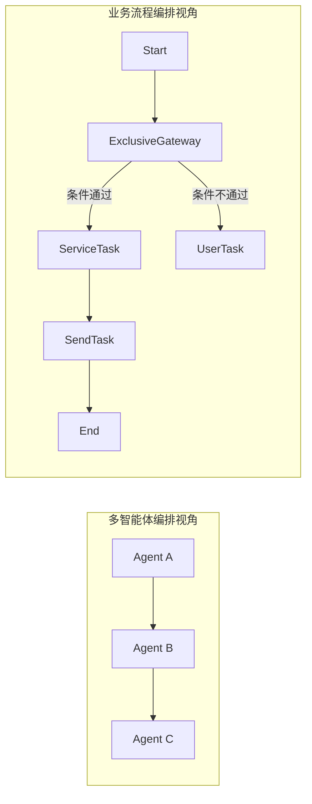

# 12.1 业务流程引擎概述

在 RAF 的多智能体编排引擎（第 11 章）基础之上，workflow-pro 提供了一套面向企业级业务流程自动化的专业能力——**业务流程编排引擎**。本章将介绍这套引擎的架构设计、与多智能体编排的关系以及核心适用场景。

## 架构定位

业务流程编排引擎并非独立的执行系统，而是建立在第 11 章图引擎基础之上的**业务层抽象**：

```mermaid
graph TB
    subgraph "第 11 章：多智能体编排"
        WE[WorkflowEngine]
        WG[WorkflowGraph]
        EVT[WorkflowEvent]
        CK[CheckpointManager]
    end

    subgraph "第 12 章：业务流程编排"
        PD[ProcessDefinition DSL]
        PI[ProcessInstance]
        SA[Standard Activities]
        SG[SagaOrchestrator]
        AT[AgentTeam / AgentPool]
        OB[Observability]
    end

    PD -->|compile()| WG
    PI -->|drives| WE
    SA -->|implements| IExecutor
    SG -->|基于| CK
    AT -->|IEdgeCondition| WG
    OB -->|consumes| EVT
```

| 层 | 职责 | 核心组件 |
|----|------|---------|
| 引擎层（第 11 章） | 图执行、SuperStep 模型、检查点、事件 | WorkflowEngine, WorkflowGraph, CheckpointManager |
| 业务层（第 12 章） | 声明式流程定义、活动节点、事务补偿、可观测性 | ProcessDefinition, ProcessInstance, SagaOrchestrator, AuditTrail |

## 什么是业务流程编排引擎

如果说多智能体编排（第 11 章）关注的是"如何组织和调度 Agent 协作"，那么业务流程编排引擎关注的是**"如何用标准化的方式定义、执行和监控企业级业务流程"**。



业务流程编排引擎的核心价值：

1. **声明式定义**：通过 YAML/JSON 声明业务流程，而非在代码中硬编码编排逻辑
2. **标准化节点**：提供 BPMN 风格的标准活动节点（ServiceTask、UserTask、ScriptTask 等）
3. **生命周期管理**：完整的流程实例状态机——创建、运行、挂起、完成、终止、失败
4. **事务保证**：SAGA 模式分布式事务补偿，保证跨步骤的数据一致性
5. **可观测性**：审计追踪、SLA 监控、消息关联，满足企业级运维要求

## 适用场景

| 场景 | 说明 | 推荐技术 |
|------|------|---------|
| 订单处理流水线 | 订单验证→库存预留→支付处理→发货通知 | ProcessDefinition + ServiceTask + SagaOrchestrator |
| 审批工作流 | 提交申请→多级审批→结果通知 | UserTask + ExclusiveGateway |
| 数据 ETL 管道 | 抽取→转换→加载，带错误重试和告警 | ScriptTask + TimerTrigger |
| 定时批处理 | 每日/每周定时执行业务流程 | CronTrigger + ServiceTask |
| 消息驱动流程 | 等待外部消息触发或推进流程 | ReceiveTask + EventBasedGateway |
| 多 Agent 协同 | 按能力路由到不同 Agent 专家 | AgentTeam + DynamicRouter |

## 章节导览

```
12.1 业务流程引擎概述               ← 当前，了解整体架构
12.2 流程定义与编译                  ← 学习如何用 YAML 定义流程
12.3 标准活动节点                     ← 认识 8 种 BPMN 节点
12.4 流程实例与状态管理               ← 掌握流程生命周期
12.5 增强网关、事件与定时调度          ← 高级流程控制
12.6 SAGA 事务与补偿链               ← 分布式事务
12.7 Agent 团队与池化管理             ← Agent 资源管理
12.8 消息关联、审计与 SLA             ← 可观测性与治理
```

建议按顺序阅读，从流程定义入手，逐步深入到状态管理、高级网关和事务补偿，最后了解团队管理和可观测性能力。
