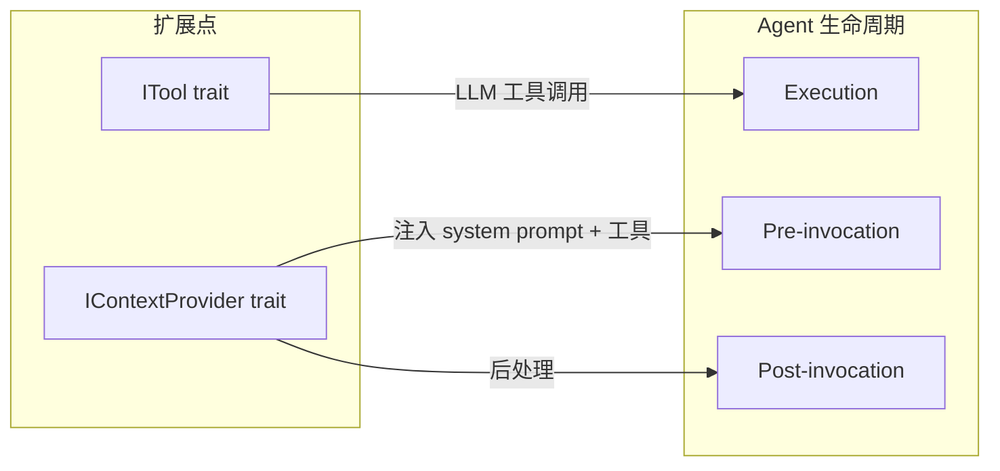

# 13.1 扩展体系概述

RAF 通过两个核心扩展点实现能力扩展：`ITool`（工具接口）和 `IContextProvider`（上下文提供器接口）。所有扩展能力都通过实现其中一个或两个接口来与框架集成。

## 扩展机制



### ITool — 工具扩展点

实现 `ITool` trait 的扩展可以作为工具注册给 Agent，Agent 通过 function calling 机制调用：

```rust
#[async_trait]
pub trait ITool: AsAny + Send + Sync {
    fn name(&self) -> &str;
    fn description(&self) -> &str;
    fn parameters(&self) -> serde_json::Value;
    async fn execute(&self, arguments: serde_json::Value) -> Result<ToolResult>;
    fn requires_approval(&self) -> bool { false }
}
```

**扩展举例**：`WebSearch`、`WebFetch`、`RhaiTool`、`McpTool` 都实现了 `ITool`，可以作为工具注册。

### IContextProvider — 上下文扩展点

实现 `IContextProvider` trait 的扩展可以在 Agent 每次调用前后注入上下文：

```rust
#[async_trait]
pub trait IContextProvider: Send + Sync {
    fn name(&self) -> &str;

    async fn on_invoking(
        &self,
        agent: &dyn IAgent,
        session: &dyn ISession,
        messages: &[ChatMessage],
        options: &AgentRunOptions,
    ) -> Result<ContextResult>;

    async fn on_invoked(
        &self,
        agent: &dyn IAgent,
        session: &dyn ISession,
        request_messages: &[ChatMessage],
        response: Option<&AgentResponse>,
        error: Option<&AgentError>,
    ) -> Result<()>;
}
```

### ContextResult — 注入载体

```rust
pub struct ContextResult {
    pub instructions: Option<String>,        // 追加到 system prompt
    pub messages: Vec<ChatMessage>,          // 注入到消息列表
    pub tools: Vec<Arc<dyn ITool>>,          // 动态工具
    pub replace_messages: bool,              // 是否替换已有消息
}
```

**扩展举例**：`SkillMemoryContextProvider`、`WebSearchContextProvider`、`McpContextProvider` 实现了 `IContextProvider`，在每次调用前自动注入记忆指令和搜索上下文。

## 扩展能力一览

| 扩展 | ITool | IContextProvider | Crate | 依赖 |
|------|-------|-----------------|-------|------|
| **WebSearch** | ✅ | ✅ (auto-search) | rust-agent-websearch | reqwest, servo-fetch, scraper |
| **WebFetch** | ✅ | ❌ | rust-agent-websearch | servo-fetch |
| **RAG** | ❌ | ✅ (`RagContextProvider`) | rust-agent-rag | 无额外 feature |
| **Wiki** | ❌ | ✅ (`WikiContextProvider`) | rust-agent-wiki | 无额外 feature |
| **Skills** | ✅ (工具) | ✅ | rust-agent-framework | 无额外依赖 |
| **Rhai** | ✅ (RhaiTool) | ❌ | rust-agent-rhai | rhai |
| **Code Sandbox** | ✅ (`CodeInterpreterTool`) | ❌ | rust-agent-sandbox | sandbox feature |
| **OpenAPI** | ✅ (`OpenApiHttpTool`) | ❌ | rust-agent-openapi | openapi feature |
| **SkillMemory** | ❌ | ✅ | rust-agent-framework | 依赖主 Agent 的 ChatClient |
| **MCP** | ✅ (McpTool) | ✅ (McpContextProvider) | rust-agent-mcp | tokio, reqwest |

## 注册扩展

### 注册工具

```rust
use rust_agent_framework::AgentBuilder;

let agent = AgentBuilder::new("my_agent")
    .chat_client(client)
    .instructions("你是一个助手。")
    .with_tool(WebSearch)           // 注册 ITool 扩展
    .with_tool(WebFetch)
    .with_tool(RhaiTool::new(/* ... */))
    .build()?;
```

### 注册上下文提供器

```rust
let agent = AgentBuilder::new("my_agent")
    .chat_client(client)
    .instructions("...")
    .with_context_provider(SkillMemoryContextProvider::new("./memory"))
    .build()?;
```

## 设计原则

1. **接口统一**：所有扩展通过 ITool 和 IContextProvider 与框架交互，保持 API 一致性
2. **可选依赖**：每个扩展 crate 独立可选，按需引入
3. **零侵入**：扩展不影响框架核心，可以通过 feature flags 控制编译
4. **MAF 兼容**：扩展设计参考 MAF 的 Middleware 和 Tool 插件体系
