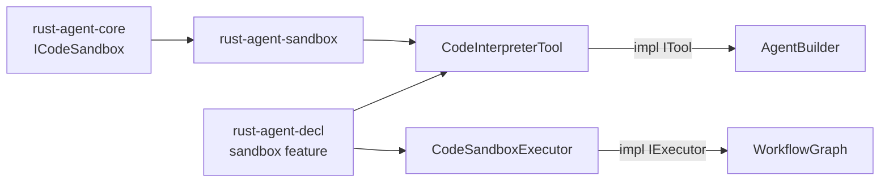

# 13.9 代码沙箱

`rust-agent-sandbox` 实现 core 中的 `ICodeSandbox` trait，提供 `code_interpreter` 工具及工作流 `ExecuteCode` 动作的运行时后端。核心 crate 仅定义契约，具体隔离能力在本 crate 按需启用。

## 架构



## 后端一览

| backend | 类型 | Feature | 隔离级别 |
|---------|------|---------|---------|
| `process` | `ProcessSandbox` | 默认 | 子进程 + 超时 |
| `container` | `ContainerSandbox` | 默认 | 增强进程包装 |
| `docker` / `podman` | `DockerSandbox` | `docker` | 容器隔离 |
| `wasm` | `WasmSandbox` | `wasm` | wasmtime 沙箱 |

## 代码注册

```rust
use std::sync::Arc;
use rust_agent_sandbox::{CodeInterpreterTool, ProcessSandbox};

let tool = CodeInterpreterTool::new(Arc::new(ProcessSandbox::new()));

AgentBuilder::new("coder")
    .chat_client(client)
    .with_tool(tool)
    .build()?;
```

Docker 后端示例：

```rust
#[cfg(feature = "docker")]
use rust_agent_sandbox::DockerSandbox;

let sandbox = DockerSandbox::new()
    .with_image("python:3.12-slim")
    .with_cpus("1.0")
    .with_pids_limit(128);
```

## 声明式配置

启用 `rust-agent-decl` 的 `sandbox` feature 后，YAML 中 `kind: code` 自动构建，无需 `with_tool()`：

```yaml
kind: prompt
name: sandbox-agent
sandbox:
  backend: process
  timeout_secs: 30
tools:
  - kind: code
    name: code_interpreter
    config:
      backend: process
      default_language: python
```

工作流 `ExecuteCode` 动作同样依赖 `sandbox` feature，顶层 `sandbox:` 为默认配置。详见 [10.3 声明式配置](../10-macros-declarative/declarative-config.md)。

## Cargo features

```toml
rust-agent-sandbox = { version = "0.1", features = ["docker", "wasm"] }
rust-agent-decl = { version = "0.1", features = ["yaml", "sandbox", "sandbox-docker", "sandbox-wasm"] }
```
