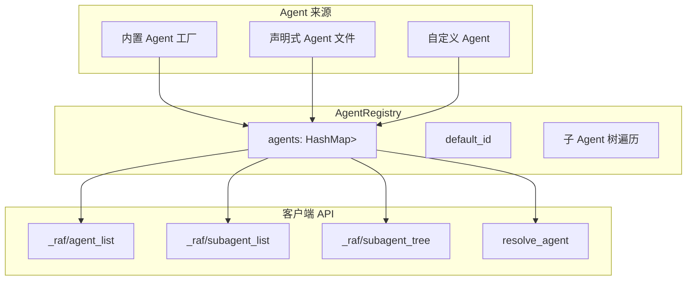

# 13.4 Agent 注册与发现

`AgentRegistry` 是宿主服务的 Agent 注册中心，负责管理所有可用的 Agent 实例，并提供注册、查找、子 Agent 发现和声明式加载功能。

## 架构



## AgentRegistry 核心 API

```rust
pub struct AgentRegistry {
    agents: HashMap<AgentId, Arc<dyn IAgent>>,
    default_id: Option<AgentId>,
}

impl AgentRegistry {
    pub fn new() -> Self;
    pub fn register(&mut self, agent: Arc<dyn IAgent>);
    pub fn get(&self, id: &AgentId) -> Option<&Arc<dyn IAgent>>;
    pub fn get_default(&self) -> Option<&Arc<dyn IAgent>>;
    pub fn resolve_agent(&self, agent_id_override: Option<&str>) -> Option<Arc<dyn IAgent>>;
    pub fn build_agent_list(&self) -> Vec<AgentInfo>;
    pub fn get_subagent_list(&self, agent_id: &AgentId) -> Vec<SubAgentInfo>;
    pub fn get_subagent_tree(&self, agent_id: &AgentId) -> Option<SubAgentNode>;
}
```

### AgentInfo — 注册信息

```rust
pub struct AgentInfo {
    pub id: String,                     // Agent 唯一标识符
    pub agent_type: String,             // Agent 类型标签
    pub name: String,                   // 人类可读名称
    pub description: String,            // 功能描述
    pub tool_names: Vec<String>,        // 注册的工具列表
    pub model_id: Option<String>,       // 使用的模型 ID
    pub capability_tags: Vec<String>,   // 能力标签
    pub has_subagents: bool,            // 是否有子 Agent
    pub is_default: bool,               // 是否为默认 Agent
}
```

### SubAgentInfo — 子 Agent 信息

```rust
pub struct SubAgentInfo {
    pub id: String,
    pub name: String,
    pub agent_type: String,
    pub description: String,
    pub capability_tags: Vec<String>,
    pub depth: usize,                   // 在 Agent 树中的深度
    pub has_subagents: bool,
}
```

### SubAgentNode — 树节点

```rust
pub struct SubAgentNode {
    pub id: String,
    pub name: String,
    pub agent_type: String,
    pub description: String,
    pub capability_tags: Vec<String>,
    pub children: Vec<SubAgentNode>,    // 递归子节点
}
```

## 内置 Agent 工厂

`AgentFactory` 创建三种预设 Agent：

```rust
pub struct AgentFactory<'a> {
    config: &'a HostConfig,
}

impl AgentFactory<'_> {
    pub async fn create_all(&self) -> Result<Vec<Arc<dyn IAgent>>>;
    fn create_coding_agent(&self) -> Result<Arc<dyn IAgent>>;
    fn create_general_agent(&self) -> Result<Arc<dyn IAgent>>;
    fn create_analysis_agent(&self) -> Result<Arc<dyn IAgent>>;
}
```

### CodingAgent — 代码专家

```rust
fn create_coding_agent(&self) -> Result<Arc<dyn IAgent>> {
    let agent = AgentBuilder::new("coding")
        .chat_client(client)
        .instructions("你是资深软件工程师...")
        .with_description("代码专家智能体")
        .with_tool(ReadFile::default())
        .with_tool(WriteFile::default())
        .with_tool(EditFile::default())
        .with_tool(ListFiles::default())
        .with_tool(SearchFile::default())
        .with_tool(FindFiles::default())
        .with_tool(RunCommand::default())
        .max_tool_rounds(15)
        .build()?;
    Ok(agent)
}
```

### GeneralAgent — 通用助手

```rust
fn create_general_agent(&self) -> Result<Arc<dyn IAgent>> {
    let agent = AgentBuilder::new("general")
        .chat_client(client)
        .instructions("你是通用 AI 助手...")
        .with_description("通用 AI 助手")
        .max_tool_rounds(5)
        .build()?;
    Ok(agent)
}
```

### AnalysisAgent — 数据分析师

```rust
fn create_analysis_agent(&self) -> Result<Arc<dyn IAgent>> {
    let agent = AgentBuilder::new("analysis")
        .chat_client(client)
        .instructions("你是数据分析师...")
        .with_description("数据分析师")
        .with_tool(ReadFile::default())
        .max_tool_rounds(10)
        .build()?;
    Ok(agent)
}
```

## 声明式 Agent 加载

从 JSON/YAML/TOML 文件加载 Agent：

```rust
use rust_agent_decl::{AgentDocument, AgentResolver};

async fn load_declarative_agents(
    agents_dir: &str,
) -> anyhow::Result<Vec<Arc<dyn IAgent>>> {
    let mut agents = Vec::new();
    let mut resolver = AgentResolver::new();

    for entry in walkdir::WalkDir::new(agents_dir) {
        let entry = entry?;
        if entry.file_type().is_file() {
            let path = entry.path();
            let ext = path.extension().and_then(|e| e.to_str());

            let doc = match ext {
                Some("json") => AgentDocument::from_json_file(path.to_str().unwrap())?,
                Some("yaml") | Some("yml") => {
                    #[cfg(feature = "yaml")]
                    { AgentDocument::from_yaml_file(path.to_str().unwrap())? }
                }
                Some("toml") => {
                    #[cfg(feature = "toml")]
                    { AgentDocument::from_toml_file(path.to_str().unwrap())? }
                }
                _ => continue,
            };

            let def = doc.inner_definition();
            let agent = resolver.resolve(def).await?;
            agents.push(agent);
        }
    }

    Ok(agents)
}
```

## 配置 Agent 预设

通过配置文件控制哪些内置 Agent 被创建：

```toml
[agents]
coding = true
general = true
analysis = false  # 禁用分析 Agent
```

## 子 Agent 树发现

### 树遍历算法

```rust
fn build_subagent_node(&self, agent: &Arc<dyn IAgent>) -> SubAgentNode {
    let meta = agent.metadata();
    let mut children = Vec::new();

    // 遍历所有已注册 Agent，检查是否为当前 Agent 的子 Agent
    for (child_id, child_agent) in &self.agents {
        if agent.get_subagent(child_id).is_some() {
            children.push(self.build_subagent_node(child_agent));
        }
    }

    SubAgentNode {
        id: agent.id().to_string(),
        name: meta.key.clone(),
        agent_type: meta.agent_type.clone(),
        description: meta.description.clone(),
        capability_tags: meta.capability_tags.clone(),
        children,
    }
}
```

### Agent 解析策略

`resolve_agent()` 的查找顺序：

1. **直接查找**：通过 `AgentId` 直接匹配
2. **子 Agent 遍历**：在所有父 Agent 上调用 `get_subagent()`
3. **默认回退**：返回第一个注册的默认 Agent

```rust
pub fn resolve_agent(&self, agent_id_override: Option<&str>) -> Option<Arc<dyn IAgent>> {
    if let Some(id_str) = agent_id_override {
        let id = AgentId::new(id_str);

        // 1. 直接查找
        if let Some(agent) = self.agents.get(&id) {
            return Some(agent.clone());
        }

        // 2. 子 Agent 遍历
        for parent in self.agents.values() {
            if let Some(sub) = parent.get_subagent(&id) {
                return Some(sub);
            }
        }
    }

    // 3. 默认回退
    self.get_default().cloned()
}
```

## ACP 集成

### Initialize 响应

```rust
// 构建 _meta.raf.agents 列表
let agent_list = registry.build_agent_list_meta();

// 注入到 initialize 响应
let mut resp = InitializeResponse::new(req.protocol_version)
    .agent_capabilities(caps);
resp.meta = Some(agent_list);
```

响应格式：

```json
{
    "_meta": {
        "raf": {
            "version": "0.1.0",
            "agents": [
                {
                    "id": "coding",
                    "agent_type": "CodingAgent",
                    "name": "coding",
                    "description": "代码专家智能体",
                    "tool_names": ["read_file", "write_file", "run_command"],
                    "has_subagents": true,
                    "is_default": true
                }
            ]
        }
    }
}
```

### Session 创建时的 Agent 选择

```rust
// 从 NewSessionRequest._meta.raf.agent_id 获取目标 Agent
let target_agent = req.meta.as_ref()
    .and_then(|m| m.get("raf.agent_id"))
    .and_then(|v| v.as_str());

let sid = uuid::Uuid::new_v4().to_string();
session_bridge.create_session(&sid, target_agent).await;
```
