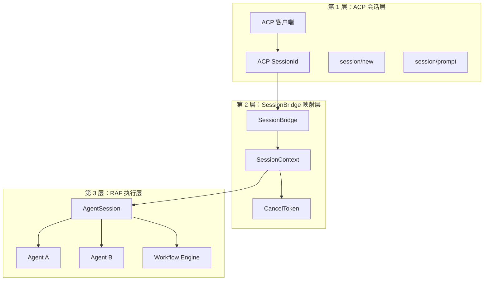
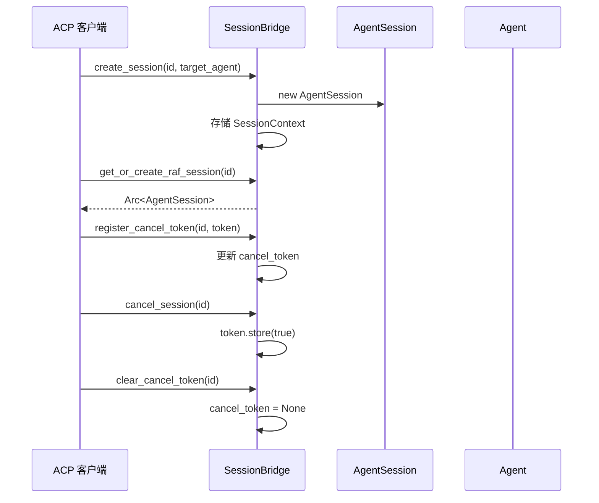
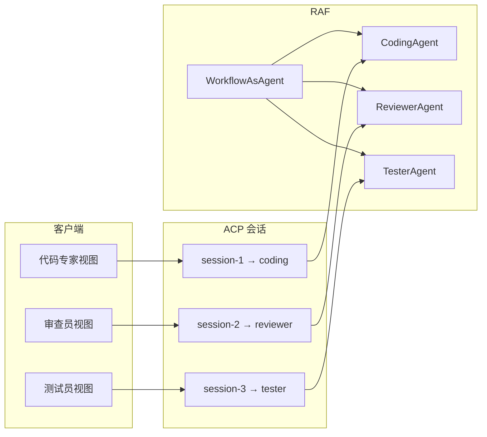

# 13.5 三层多智能体编排模型

RAF 宿主服务采用三层编排架构，将 ACP 协议的会话管理、RAF 的多 Agent 执行和客户端的流式渲染清晰地分层解耦。

## 三层架构



## 第 1 层：ACP 会话层

客户端通过 ACP 协议与宿主通信：

```json
// 1. 创建会话（指定目标 Agent）
{
    "method": "session/new",
    "params": {
        "_meta": { "raf": { "agent_id": "coding_workflow" } }
    }
}

// 2. 发送提示
{
    "method": "session/prompt",
    "params": {
        "session_id": "abc-123",
        "messages": [{"role": "user", "content": "请审查这段代码"}]
    }
}

// 3. 取消（可选）
{
    "method": "session/cancel",
    "params": {
        "session_id": "abc-123"
    }
}
```

## 第 2 层：SessionBridge 映射层

`SessionBridge` 负责 ACP 会话与 RAF 会话之间的映射：

```rust
pub struct SessionBridge {
    sessions: RwLock<HashMap<String, SessionContext>>,
}

pub struct SessionContext {
    pub raf_session: Arc<AgentSession>,     // RAF 会话
    pub target_agent_id: String,            // 目标 Agent ID
    pub cancel_token: Option<Arc<AtomicBool>>, // 取消令牌
}
```

### 会话生命周期



### 会话操作

| 操作 | 方法 | 说明 |
|------|------|------|
| 创建会话 | `create_session(id, target)` | 创建 AgentSession 并存储 |
| 获取会话 | `get_or_create_raf_session(id)` | 获取或按需创建 |
| 取消会话 | `cancel_session(id)` | 设置 cancel_token = true |
| 注册令牌 | `register_cancel_token(id, token)` | 注册本轮取消令牌 |
| 清除令牌 | `clear_cancel_token(id)` | 轮次完成后清理 |
| 移除会话 | `remove_session(id)` | 删除会话记录 |

## 第 3 层：RAF 执行层

RAF Agent 通过 `IAgent::run()` 执行，使用 `AgentSession` 维护对话历史：

```rust
// 提示处理流程
async fn handle_prompt(
    req: PromptRequest,
    registry: &AgentRegistry,
    bridge: &SessionBridge,
) {
    // 1. 解析目标 Agent
    let target_agent = bridge.get_target_agent_id(&req.session_id).await;
    let agent = registry.resolve_agent(target_agent.as_deref()).unwrap();

    // 2. 获取或创建 RAF 会话
    let raf_session = bridge.get_or_create_raf_session(&req.session_id).await?;

    // 3. 创建取消令牌
    let cancel_token = Arc::new(AtomicBool::new(false));
    bridge.register_cancel_token(&req.session_id, cancel_token.clone()).await;

    // 4. 映射选项
    let options = map_acp_options_to_agent_options(&req);

    // 5. 运行 Agent
    let stream = agent.run(
        req.messages,
        Some(raf_session),
        options,
    ).await?;

    // 6. 处理流式输出，发送 session/update
    // 7. 完成后清理取消令牌
}
```

## 独立子 Agent 会话

客户端可以为每个子 Agent 创建独立的 ACP 会话，实现并行流式视图：



### 独立会话创建

```json
// 父会话（执行编排）
{"method": "session/new", "params": {"_meta": {"raf": {"agent_id": "seq_workflow"}}}}

// 子 Agent 独立会话（用于前端渲染各自的流式视图）
{"method": "session/new", "params": {"_meta": {"raf": {"agent_id": "coding"}}}}
{"method": "session/new", "params": {"_meta": {"raf": {"agent_id": "reviewer"}}}}
{"method": "session/new", "params": {"_meta": {"raf": {"agent_id": "tester"}}}}
```

## 提示处理流程

```rust
// 完整的 session/prompt 处理
async fn handle_prompt(
    req: PromptRequest,
    responder: impl Responder,
    conn: ConnectionTo<Client>,
    registry: &AgentRegistry,
    bridge: &SessionBridge,
) {
    // 1. 解析 Agent
    let target_id = bridge.get_target_agent_id(&req.session_id).await;
    let agent = registry.resolve_agent(target_id.as_deref())
        .unwrap_or_else(|| registry.get_default().cloned().unwrap());

    // 2. 准备会话
    let raf_session = bridge.get_or_create_raf_session(&req.session_id).await?;
    let cancel_token = Arc::new(AtomicBool::new(false));
    bridge.register_cancel_token(&req.session_id, cancel_token).await;

    // 3. 映射选项
    let options = extract_run_options(&req);

    // 4. 添加历史消息
    let history = raf_session.messages().await;
    let all_messages = if history.is_empty() {
        req.messages
    } else {
        let mut msgs = history;
        msgs.extend(req.messages);
        msgs
    };

    // 5. 运行 Agent
    let stream = agent.run(all_messages, Some(raf_session.clone()), options).await?;

    // 6. 发送流式更新
    tokio::pin!(stream);
    while let Some(chunk) = stream.next().await {
        // 检查取消
        if cancel_token.load(Ordering::SeqCst) {
            break;
        }

        let update = chunk_to_session_update(chunk, &agent);
        conn.send_notification(update).await?;
    }

    // 7. 保存消息到会话
    raf_session.add_messages(final_messages).await?;

    // 8. 清理
    bridge.clear_cancel_token(&req.session_id).await;
}
```
