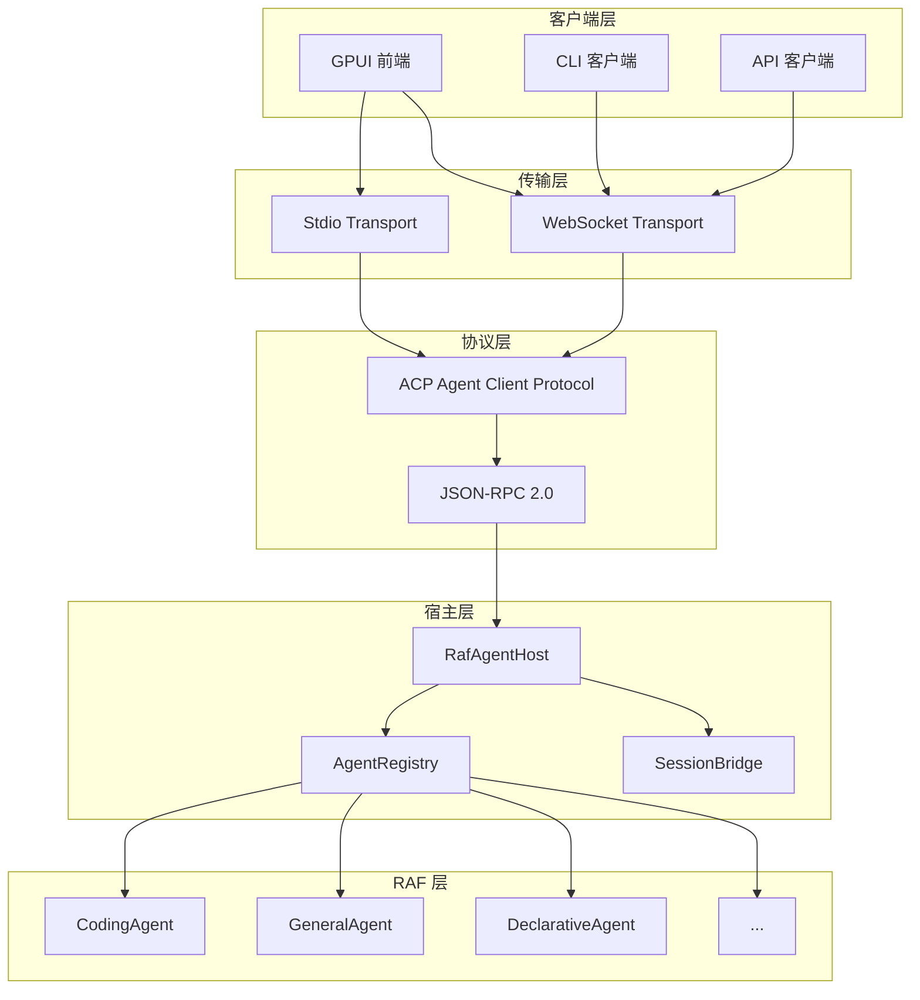

# 13.1 Host Service 概述

`rust-agent-host` 是基于 ACP（Agent Client Protocol）的多 Agent 托管服务器，为 RAF 框架提供远程服务能力。它将 RAF Agent 桥接到 ACP 兼容客户端（如 GPUI 前端），支持多 Agent 注册、发现、流式输出和会话管理。

## 总体架构



## 核心组件

### RafAgentHost — 宿主服务核心

`RafAgentHost` 是 ACP Agent 处理器，负责所有 ACP 请求的处理：

```rust
pub struct RafAgentHost {
    pub registry: Arc<AgentRegistry>,
    pub session_bridge: Arc<SessionBridge>,
}
```

处理四种 ACP 操作：

| 操作 | 说明 |
|------|------|
| `initialize` | 返回 Agent 能力列表和注册 Agent 清单 |
| `session/new` | 创建新会话，可指定目标 Agent |
| `session/prompt` | 处理用户提示，执行 Agent 并流式返回 |
| `session/cancel` | 取消当前运行 |

### Run 方法

```rust
impl RafAgentHost {
    pub async fn run(
        self,
        transport: impl ConnectTo<Agent>,
    ) -> Result<()> {
        let acp_agent = Agent;

        acp_agent.builder()
            .name("rust-agent-host")
            // 注册四个处理器
            .on_receive_request::<InitializeRequest>(/* ... */)
            .on_receive_request::<NewSessionRequest>(/* ... */)
            .on_receive_request::<PromptRequest>(/* ... */)
            .on_receive_notification::<CancelNotification>(/* ... */)
            .connect_to(transport)
            .await
    }
}
```

## 关键特性

### 多 Agent 托管

单个 Host 进程可以同时托管多个 Agent：

- **内置 Agent**：通过 `AgentFactory` 创建 CodingAgent、GeneralAgent、AnalysisAgent
- **声明式 Agent**：通过 `AgentDocument` 从 JSON/YAML/TOML 文件加载
- **自定义 Agent**：通过 `AgentRegistry::register()` 注册任意 IAgent 实现

### 标签化流式输出

每个 `session/update` 携带 `_meta.raf.agent_id`，使客户端可以区分多 Agent 对话中的发言者：

```json
{
    "type": "session/update",
    "content": "这是代码专家的回复...",
    "_meta": {
        "raf": {
            "agent_id": "coding",
            "agent_type": "CodingAgent"
        }
    }
}
```

### 子 Agent 发现

通过 `get_subagent()` 递归发现 Agent 树：
- `_raf/agent_list` — 返回所有注册 Agent 的扁平列表
- `_raf/subagent_list` — 返回指定 Agent 的直接子 Agent
- `_raf/subagent_tree` — 返回完整的递归 Agent 树

### 双传输模式

支持两种传输协议，可通过配置文件切换：

| 模式 | 适用场景 |
|------|---------|
| Stdio | 本地子进程（IDE 集成） |
| WebSocket | 远程部署（服务化） |

## 配置系统

### 分层配置

使用 Figment 实现四层配置优先级：

```rust
pub fn load_config() -> anyhow::Result<HostConfig> {
    // Layer 1: TOML 配置文件 (host.toml 或 --config)
    // Layer 2: 环境变量 (RAF_ 前缀)
    // Layer 3: CLI 参数
    // Layer 4: 默认值

    Figment::new()
        .merge(Toml::file("host.toml"))
        .merge(Env::prefixed("RAF_"))
        .merge(Serialized::defaults(&cli_args))
        .extract()
}
```

### 配置结构

```rust
pub struct HostConfig {
    pub mode: TransportMode,          // stdio 或 ws
    pub ws_bind: String,              // WebSocket 绑定地址
    pub provider: ProviderConfig,     // LLM 提供商配置
    pub agents: AgentPresetsConfig,   // 内置 Agent 开关
    pub agents_dir: Option<String>,   // 声明式 Agent 目录
}
```

### CLI 参数

```bash
# WebSocket 模式
rust-agent-host --mode ws --bind 0.0.0.0:9876 --api-key $DEEPSEEK_API_KEY

# Stdio 模式（默认）
rust-agent-host --api-key $DEEPSEEK_API_KEY

# 加载声明式 Agent
rust-agent-host --agents-dir ./agents

# 指定配置文件
rust-agent-host --config production.toml
```

## 快速启动

```rust
use rust_agent_host::{HostConfig, load_config, transport};
use rust_agent_host::registry::AgentRegistry;
use rust_agent_host::bridge::SessionBridge;
use rust_agent_host::agents::AgentFactory;
use std::sync::Arc;

#[tokio::main]
async fn main() -> anyhow::Result<()> {
    // 1. 加载配置
    let config = load_config()?;

    // 2. 创建 Agent 注册表
    let mut registry = AgentRegistry::new();

    // 3. 创建内置 Agent
    let factory = AgentFactory::new(&config);
    let builtin_agents = factory.create_all().await?;
    for agent in builtin_agents {
        registry.register(agent);
    }

    // 4. 加载声明式 Agent
    if let Some(ref dir) = config.agents_dir {
        let decl_agents = load_declarative_agents(dir).await?;
        for agent in decl_agents {
            registry.register(agent);
        }
    }

    // 5. 创建会话桥梁
    let registry = Arc::new(registry);
    let session_bridge = Arc::new(SessionBridge::new());

    // 6. 启动传输
    match config.mode {
        TransportMode::Stdio => {
            transport::stdio::run_stdio(registry, session_bridge).await?;
        }
        TransportMode::Ws => {
            transport::websocket::run_ws_server(
                config.ws_bind,
                registry,
                session_bridge,
            ).await?;
        }
    }

    Ok(())
}
```
