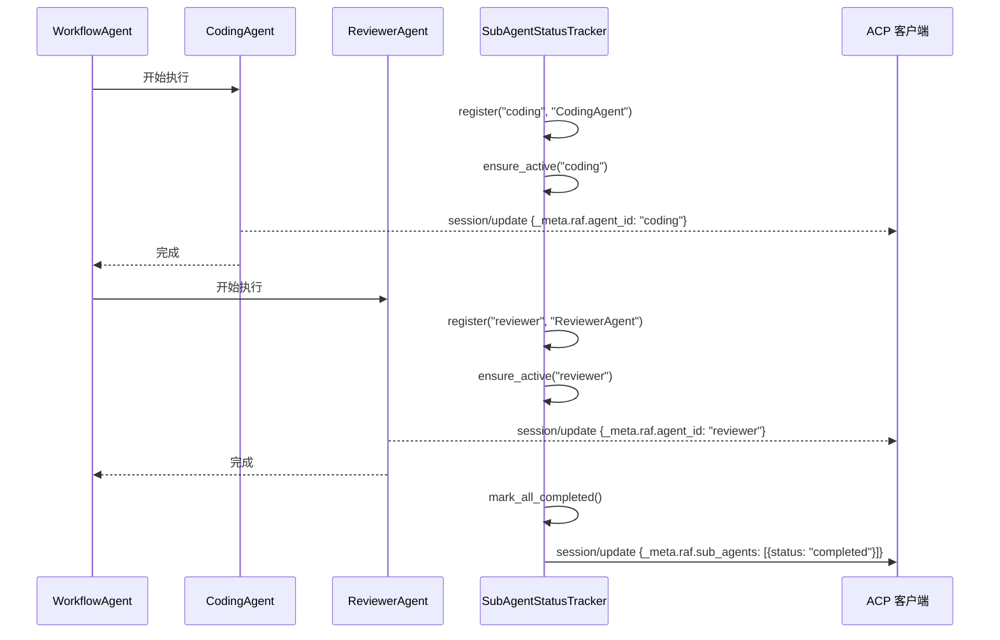

# 13.6 标签化流式输出

标签化流式输出（Tagged Streaming）是 RAF 宿主服务的核心功能之一——每个 `session/update` 事件携带 `_meta.raf.agent_id` 标签，使前端能够区分多 Agent 对话中不同 Agent 的输出，并实时追踪各子 Agent 的执行状态。

## 核心概念



## SubAgentStatusTracker

`SubAgentStatusTracker` 追踪多 Agent 编排中每个子 Agent 的执行状态：

```rust
pub struct SubAgentStatusTracker {
    agents: Mutex<HashMap<String, SubAgentState>>,
}

pub struct SubAgentState {
    pub agent_type: String,
    pub status: SubAgentStatus,       // Pending | Executing | Completed | Error
    pub started_at: Option<Instant>,
    pub completed_at: Option<Instant>,
}

pub enum SubAgentStatus {
    Pending,
    Executing,
    Completed,
    Error,
}
```

### 核心 API

| 方法 | 说明 |
|------|------|
| `register(id, type)` | 注册子 Agent 进行追踪 |
| `register_all(ids)` | 批量注册 |
| `ensure_active(id)` | 标记为执行中（首次从 Pending 切换时返回 true） |
| `mark_completed(id)` | 标记为已完成 |
| `mark_error(id)` | 标记为错误 |
| `mark_all_completed()` | 将所有活跃 Agent 标记为完成 |
| `build_status_meta()` | 构建 `_meta` 中的状态信息 |
| `all_terminated()` | 检查是否全部进入终止状态 |

### 状态元数据

```rust
pub fn build_status_meta(&self) -> serde_json::Value {
    let statuses: Vec<serde_json::Value> = agents.iter().map(|(id, state)| {
        serde_json::json!({
            "id": id,
            "type": state.agent_type,
            "status": state.status,           // "pending" | "executing" | "completed" | "error"
            "elapsed_ms": state.started_at.map(|t| t.elapsed().as_millis() as u64),
        })
    }).collect();

    serde_json::json!({
        "sub_agents": statuses
    })
}
```

## 流式输出格式

### 带标签的流式更新

每个 `session/update` 事件携带 Agent 标识：

```json
{
    "jsonrpc": "2.0",
    "method": "session/update",
    "params": {
        "session_id": "abc-123",
        "content": [
            {
                "type": "text",
                "text": "这段代码有一个潜在的性能问题..."
            }
        ],
        "_meta": {
            "raf": {
                "agent_id": "coding",
                "agent_type": "CodingAgent",
                "parent_agent_id": "workflow_1",
                "sub_agents": [
                    {
                        "id": "coding",
                        "type": "CodingAgent",
                        "status": "executing",
                        "elapsed_ms": 1234
                    },
                    {
                        "id": "reviewer",
                        "type": "ReviewerAgent",
                        "status": "pending"
                    }
                ]
            }
        }
    }
}
```

### 字段说明

| 字段 | 说明 |
|------|------|
| `_meta.raf.agent_id` | 当前发言 Agent 的 ID |
| `_meta.raf.agent_type` | Agent 类型标签 |
| `_meta.raf.parent_agent_id` | 父编排 Agent ID（如果是子 Agent） |
| `_meta.raf.sub_agents` | 所有追踪中子 Agent 的状态数组 |
| `_meta.raf.sub_agents[].id` | 子 Agent ID |
| `_meta.raf.sub_agents[].type` | 子 Agent 类型 |
| `_meta.raf.sub_agents[].status` | 状态：pending / executing / completed / error |
| `_meta.raf.sub_agents[].elapsed_ms` | 已执行时长（毫秒） |

## 前端渲染示例

### 多 Agent 对话视图

前端可以利用 `agent_id` 标签将不同 Agent 的输出渲染到独立的对话区域：

```javascript
// 前端流式事件处理
function handleSessionUpdate(update) {
    const agentId = update._meta?.raf?.agent_id || "unknown";
    const content = update.content;

    for (const part of content) {
        if (part.type === "text") {
            // 追加到对应 Agent 的对话面板
            appendToAgentPanel(agentId, part.text);
        } else if (part.type === "reasoning") {
            appendToAgentReasoning(agentId, part.text);
        }
    }

    // 更新子 Agent 状态 UI
    const subAgents = update._meta?.raf?.sub_agents || [];
    updateSubAgentStatusPanel(subAgents);
}
```

### 子 Agent 状态面板

```javascript
function updateSubAgentStatusPanel(subAgents) {
    for (const agent of subAgents) {
        const statusIcon = {
            pending: "⏳",
            executing: "🔄",
            completed: "✅",
            error: "❌",
        }[agent.status];

        renderStatusBadge(agent.id, statusIcon, agent.elapsed_ms);
    }
}
```

## 在 ACP Handler 中的集成

```rust
async fn handle_prompt_with_tracking(
    req: PromptRequest,
    registry: &AgentRegistry,
    bridge: &SessionBridge,
    conn: &ConnectionTo<Client>,
) {
    let tracker = SubAgentStatusTracker::new();

    // 如果 Agent 是工作流，注册所有子 Agent
    if is_workflow_agent(&agent) {
        let sub_agents = discover_sub_agents(&agent, registry);
        tracker.register_all(&sub_agents);
    }

    let stream = agent.run(messages, session, options).await?;

    tokio::pin!(stream);
    while let Some(chunk) = stream.next().await {
        let mut meta = serde_json::Map::new();

        // 注入 Agent 标识
        meta.insert("agent_id".into(), json!(agent.id().to_string()));
        meta.insert("agent_type".into(), json!(agent.metadata().agent_type));

        // 追踪状态（如果状态发生变化）
        if tracker.ensure_active(agent.id().to_string()) {
            // 状态从 Pending → Executing，附加状态信息
        }

        // 注入子 Agent 状态
        let status_meta = tracker.build_status_meta();
        for (key, value) in status_meta.as_object().unwrap() {
            meta.insert(key.clone(), value.clone());
        }

        let update = build_update(session_id, chunk, meta);
        conn.send_notification(update).await?;
    }

    // 标记全部完成
    tracker.mark_all_completed();
    let final_meta = tracker.build_status_meta();
    // 发送最终状态更新
}
```

## 注意事项

1. **状态变化频率**：`ensure_active` 仅在首次从 Pending 切换时返回 true，避免不必要的状态更新
2. **元数据开销**：每个 `session/update` 都携带 `_meta.raf`，对于高频流式输出需要考虑带宽
3. **线程安全**：`SubAgentStatusTracker` 使用 `Mutex` 保护内部状态，适用于多线程环境
4. **超时处理**：`elapsed_ms` 持续增长，客户端可用于检测长时间无响应的 Agent
5. **前端解耦**：`agent_id` 标签使前端可以灵活选择渲染策略——全合并视图或多面板视图
