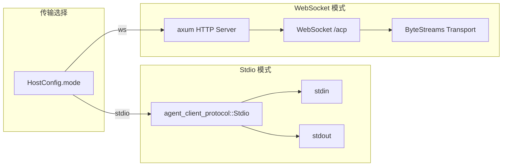

# 13.3 传输层（Stdio / WebSocket）

RAF 宿主服务支持两种传输模式：Stdio（标准输入输出，用于本地子进程通信）和 WebSocket（用于远程网络通信）。

## 传输架构



## Stdio 传输

Stdio 模式是默认传输方式，适用于本地子进程场景（如 IDE 插件启动 Agent 进程并与之通信）。

### 实现

```rust
pub async fn run_stdio(
    registry: Arc<AgentRegistry>,
    session_bridge: Arc<SessionBridge>,
) -> Result<()> {
    info!("Starting ACP server in Stdio mode");

    let host = RafAgentHost {
        registry,
        session_bridge,
    };

    // 使用 ACP SDK 内置的 Stdio 传输
    let transport = agent_client_protocol::Stdio::new();

    host.run(transport).await?;

    Ok(())
}
```

### 通信格式

Stdio 传输使用行分隔的 JSON（Line-Delimited JSON）：

- **stdin**：每行一个 JSON-RPC 2.0 消息
- **stdout**：每行一个 JSON-RPC 2.0 消息或 `session/update` 通知

```
→ {"jsonrpc":"2.0","method":"initialize","params":{...}}
← {"jsonrpc":"2.0","result":{...}}
→ {"jsonrpc":"2.0","method":"session/new","params":{...}}
← {"jsonrpc":"2.0","result":{"session_id":"..."}}
→ {"jsonrpc":"2.0","method":"session/prompt","params":{...}}
← {"jsonrpc":"2.0","method":"session/update","params":{"content":[...]}}
...
```

### 使用方式

```bash
# 启动 Stdio 模式（默认）
rust-agent-host --api-key $DEEPSEEK_API_KEY

# 或显式指定
rust-agent-host --mode stdio --api-key $DEEPSEEK_API_KEY

# 客户端通过子进程通信
# IDE 插件: spawn("rust-agent-host", ["--api-key", key])
```

## WebSocket 传输

WebSocket 模式适用于远程部署，通过 axum HTTP 框架提供 WebSocket 升级端点。

### 实现

```rust
pub async fn run_ws_server(
    bind_addr: String,
    registry: Arc<AgentRegistry>,
    session_bridge: Arc<SessionBridge>,
) -> Result<()> {
    info!(addr = %bind_addr, "Starting ACP WebSocket server");

    let app = Router::new()
        .route("/acp", any(ws_handler))   // WebSocket 升级端点
        .with_state(WsState {
            registry,
            session_bridge,
        });

    let listener = tokio::net::TcpListener::bind(&bind_addr).await?;
    axum::serve(listener, app).await?;

    Ok(())
}
```

### WebSocket 连接处理

每个 WebSocket 连接的处理流程：

```rust
async fn handle_socket(socket: WebSocket, state: WsState) {
    // 1. 分离 WebSocket 为 sender/receiver
    let (_ws_sender, mut ws_receiver) = socket.split();

    // 2. 创建双工通道 (64KB 缓冲区)
    let (dup_a, mut dup_b) = tokio::io::duplex(64 * 1024);

    // 3. 创建 ACP ByteStreams 传输
    let (reader, writer) = tokio::io::split(dup_a);
    let transport = ByteStreams::new(writer.compat_write(), reader.compat());

    // 4. 启动 ACP 处理器
    let host = RafAgentHost {
        registry: state.registry.clone(),
        session_bridge: state.session_bridge.clone(),
    };
    let acp_handle = tokio::spawn(async move {
        host.run(transport).await
    });

    // 5. 桥接 WebSocket ↔ ACP
    // WebSocket Text → dup_b (write)
    // dup_b → ACP 处理器消费

    // 6. 等待任一端完成
    tokio::select! {
        res = acp_handle => { /* ... */ }
        res = ws_to_acp => { /* ... */ }
    }
}
```

### WebSocket 消息格式

与 Stdio 相同，使用行分隔的 JSON：

- **Text 消息**：每行一个 JSON-RPC 2.0 消息
- **Binary 消息**：每行一个 JSON-RPC 2.0 消息
- **Ping/Pong**：自动处理保持连接活跃
- **Close**：正常关闭连接

### 使用方式

```bash
# 启动 WebSocket 模式
rust-agent-host --mode ws --bind 0.0.0.0:9876 --api-key $DEEPSEEK_API_KEY

# 客户端连接
# ws://localhost:9876/acp
```

## 配置切换

### 通过 CLI

```bash
# Stdio
rust-agent-host --mode stdio

# WebSocket
rust-agent-host --mode ws --bind 127.0.0.1:9876
```

### 通过配置文件 (host.toml)

```toml
# Stdio 模式
mode = "stdio"

# WebSocket 模式
mode = "ws"
ws_bind = "0.0.0.0:9876"

[provider]
provider = "deepseek"
model = "deepseek-v4-flash"
api_key = "$DEEPSEEK_API_KEY"

[agents]
coding = true
general = true
analysis = true
```

### 通过环境变量

```bash
export RAF_MODE=ws
export RAF_WS_BIND=0.0.0.0:9876
export RAF_PROVIDER__PROVIDER=deepseek
export RAF_PROVIDER__MODEL=deepseek-v4-flash
```

## 传输对比

| 特性 | Stdio | WebSocket |
|------|-------|-----------|
| 适用场景 | 本地 IDE 集成 | 远程服务部署 |
| 连接方式 | 父子进程 stdin/stdout | TCP WebSocket |
| 并发客户端 | 单客户端 | 多客户端 |
| 部署模式 | 进程内 | 独立服务 |
| 安全隔离 | 操作系统进程隔离 | 需要 TLS + 认证 |
| 默认端口 | N/A | 9876 |
| 状态管理 | 进程生命周期 | 连接生命周期 |

## 多客户端处理

WebSocket 模式下，每个客户端连接拥有独立的：
- ACP session（通过 `SessionBridge` 隔离）
- 取消令牌
- 流式输出通道

```rust
// 每个 WebSocket 连接创建独立的 RafAgentHost
let host = RafAgentHost {
    registry: state.registry.clone(),       // 共享 AgentRegistry
    session_bridge: state.session_bridge.clone(), // 共享 SessionBridge
};
```

`AgentRegistry` 和 `SessionBridge` 在多个连接间共享（通过 `Arc`），确保 Agent 状态的一致性和跨连接会话管理。
