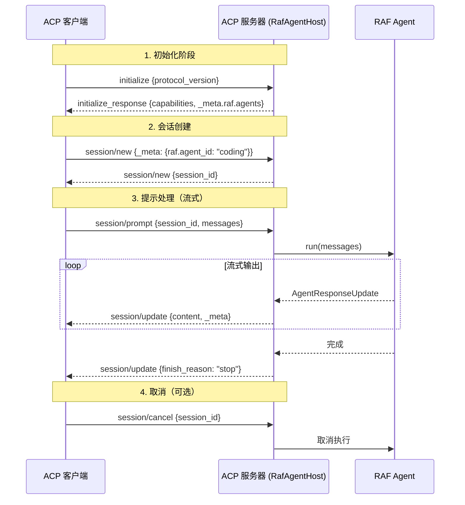

# 14.2 ACP 协议与消息格式

ACP（Agent Client Protocol）是 RAF 宿主服务使用的客户端-服务器协议，基于 JSON-RPC 2.0，提供 Agent 初始化、会话管理和提示处理能力。

## 协议架构



## 消息格式

### Initialize 请求

```json
{
    "jsonrpc": "2.0",
    "method": "initialize",
    "params": {
        "protocol_version": "0.14",
        "capabilities": {
            "prompts": {},
            "sessions": {},
            "mcp": {}
        }
    }
}
```

### Initialize 响应

```json
{
    "jsonrpc": "2.0",
    "result": {
        "protocol_version": "0.14",
        "capabilities": {
            "prompts": {},
            "sessions": {},
            "mcp": {}
        },
        "_meta": {
            "raf": {
                "version": "0.1.0",
                "agents": [
                    {
                        "id": "coding",
                        "agent_type": "CodingAgent",
                        "name": "coding",
                        "description": "代码专家智能体",
                        "tool_names": ["read_file", "write_file", "run_command"],
                        "has_subagents": false,
                        "is_default": true
                    },
                    {
                        "id": "general",
                        "agent_type": "GeneralAgent",
                        "name": "general",
                        "description": "通用 AI 助手",
                        "tool_names": [],
                        "has_subagents": false,
                        "is_default": false
                    }
                ]
            }
        }
    }
}
```

### Session New 请求

```json
{
    "jsonrpc": "2.0",
    "method": "session/new",
    "params": {
        "_meta": {
            "raf": {
                "agent_id": "coding"
            }
        }
    }
}
```

- `_meta.raf.agent_id` 为可选字段，不指定时使用默认 Agent
- 客户端可以为不同子 Agent 创建独立 session

### Session New 响应

```json
{
    "jsonrpc": "2.0",
    "result": {
        "session_id": "a1b2c3d4-e5f6-7890-abcd-ef1234567890"
    }
}
```

### Session Prompt 请求

```json
{
    "jsonrpc": "2.0",
    "method": "session/prompt",
    "params": {
        "session_id": "a1b2c3d4-e5f6-7890-abcd-ef1234567890",
        "messages": [
            {
                "role": "user",
                "content": "请用 Rust 写一个快速排序实现"
            }
        ],
        "_meta": {
            "raf": {
                "options": {
                    "max_rounds": 10,
                    "temperature": 0.7
                }
            }
        }
    }
}
```

### Session Update 流式事件

服务器通过连续的 `session/update` 通知推送流式输出：

```json
{
    "jsonrpc": "2.0",
    "method": "session/update",
    "params": {
        "session_id": "a1b2c3d4-e5f6-7890-abcd-ef1234567890",
        "content": [
            {
                "type": "text",
                "text": "以下是"
            }
        ],
        "_meta": {
            "raf": {
                "agent_id": "coding",
                "sub_agents": [
                    {"id": "reviewer", "type": "CodingAgent", "status": "executing"}
                ]
            }
        }
    }
}
```

完成事件：

```json
{
    "jsonrpc": "2.0",
    "method": "session/update",
    "params": {
        "session_id": "a1b2c3d4-e5f6-7890-abcd-ef1234567890",
        "content": [],
        "finish_reason": "stop",
        "usage": {
            "prompt_tokens": 150,
            "completion_tokens": 300,
            "total_tokens": 450
        }
    }
}
```

## AgentRunOptions 映射

RAF 的 `AgentRunOptions` 通过 ACP 消息中的 `_meta.raf.options` 传递：

| ACP Options | RAF AgentRunOptions | 说明 |
|-------------|---------------------|------|
| `max_rounds` | `max_rounds` | 最大工具调用轮数 |
| `temperature` | `temperature` | LLM 温度参数 |
| `max_tokens` | `max_tokens` | 最大生成 token 数 |
| `instructions` | `instructions_override` | 覆盖系统指令 |
| `stream` | `stream` | 是否启用流式输出 |

## 工具审批消息

当 Agent 调用需要审批的工具时，通过 `session/update` 发送审批请求：

```json
{
    "jsonrpc": "2.0",
    "method": "session/update",
    "params": {
        "session_id": "...",
        "content": [
            {
                "type": "tool_approval_required",
                "tool_name": "run_command",
                "call_id": "call_abc123",
                "arguments": {
                    "command": "rm -rf /tmp/*",
                    "working_directory": "/home/user"
                }
            }
        ],
        "_meta": {
            "raf": {
                "agent_id": "coding",
                "requires_approval": true
            }
        }
    }
}
```

客户端通过 `session/prompt` 的 continuation 消息响应审批：

```json
{
    "jsonrpc": "2.0",
    "method": "session/prompt",
    "params": {
        "session_id": "...",
        "continuation": {
            "call_id": "call_abc123",
            "approved": true,
            "reason": null
        }
    }
}
```

## 协议版本记录

RAF 使用的 ACP 协议版本为 `0.14`（`agent-client-protocol` crate 版本）。

```rust
pub struct ProtocolVersionRecord {
    pub version: String, // "responses"
}
```

## 扩展方法

RAF 在标准 ACP 协议之上添加了扩展方法（通过 `_raf/` 前缀标识）：

| 方法 | 说明 |
|------|------|
| `_raf/agent_list` | 获取所有注册 Agent 的列表 |
| `_raf/subagent_list` | 获取指定 Agent 的子 Agent 列表 |
| `_raf/subagent_tree` | 获取指定 Agent 的完整树结构 |

这些扩展方法通过 ACP 的 `_meta` 元数据通道实现，不需要额外的 RPC 方法注册。
