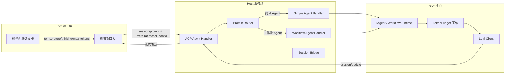

# 14.7 IDE 集成与每轮模型配置

本章详细介绍如何将 `rust-agent-host` 作为 IDE 的服务端进程，通过 ACP 协议对接聊天窗口，并支持每轮对话动态传递模型配置。

## 架构概览



## 每轮模型配置

### 设计原理

IDE 场景下，用户需要在不同任务间灵活切换模型参数：

- **快速问答**：低温度（0.1）、关闭思考模式、小 max_tokens
- **深度重构**：高温度（0.7）、启用思考模式、大 max_tokens
- **代码审查**：中温度（0.3）、启用思考模式（high 级别）

ACP 协议本身没有原生的模型配置字段。RAF 使用 `_meta.raf.model_config` 命名空间作为私有扩展通道，允许客户端在每轮 `session/prompt` 请求中传递配置覆盖项。

### 支持的配置字段

| 字段 | 类型 | 说明 | 默认值 |
|------|------|------|--------|
| `model_id` | `string` | 模型 ID（仅元数据记录，不切换已绑定客户端） | 全局配置 |
| `temperature` | `float` | 温度参数（0.0 - 2.0） | 全局配置 |
| `max_tokens` | `uint` | 最大输出 token 数 | 全局配置 |
| `thinking` | `bool` | 是否启用思考（推理）模式 | `true` |
| `thinking_level` | `string` | 思考等级：`"high"` 或 `"max"` | 无（仅 thinking=true 时生效） |
| `context_window_tokens` | `uint` | 上下文窗口大小（影响压缩预算） | 全局配置 |
| `max_output_tokens` | `uint` | 最大输出 token 数（影响压缩预算） | 全局配置 |

### 配置优先级

配置按以下优先级从高到低应用：

1. **每轮配置**（`_meta.raf.model_config`）—— 最高优先级
2. **全局配置**（`host.toml` / 环境变量 / CLI 参数）
3. **LLM 提供商默认值** —— 最低优先级

### 请求示例

```json
{
  "jsonrpc": "2.0",
  "method": "session/prompt",
  "params": {
    "session_id": "a1b2c3d4-e5f6-7890-abcd-ef1234567890",
    "prompt": [
      {
        "type": "text",
        "text": "请重构这个函数，提取公共逻辑"
      }
    ],
    "_meta": {
      "raf": {
        "agent_id": "coding",
        "model_config": {
          "temperature": 0.3,
          "max_tokens": 8192,
          "thinking": true,
          "thinking_level": "high"
        }
      }
    }
  }
}
```

### 思考模式说明

RAF 支持DeepSeek 风格的思考（推理）模式：

- `thinking: true`：模型先输出 `reasoning_content`（推理过程），再输出 `content`（最终答案）
- `thinking: false`：模型直接输出 `content`
- `thinking_level: "high"`：标准推理深度
- `thinking_level: "max"`：最大推理深度（消耗更多 token）

思考内容通过 ACP `session/update` 的 `AgentThoughtChunk` 类型流式输出，客户端可将其渲染为折叠区域。

## 上下文管理

### 自动压缩

Host 服务端内置 `TokenBudgetStrategy` 上下文压缩管线，自动管理长会话的上下文窗口：

1. **Token 计数**：使用 `EstimateCounter`（约 4 字符/token）估算消息总 token 数
2. **预算计算**：`输入预算 = context_window_tokens - max_output_tokens`
3. **压缩触发**：当消息总 token 数超过预算时自动触发
4. **压缩策略**：
   - **Phase 1**：将旧的工具调用结果组折叠为摘要（`[Earlier tool calls: N call(s) were made and completed]`）
   - **Phase 2**：从最早的非系统消息开始截断，直到符合预算
   - 系统消息始终保留

### 配置上下文窗口

在 `host.toml` 中配置模型的上下文窗口大小：

```toml
[provider]
provider = "deepseek"
model = "agnes-2.0-flash"
context_window_tokens = 128000
max_output_tokens = 8192
```

或通过 CLI / 环境变量：

```bash
# CLI
cargo run -p rust-agent-host -- --context-window-tokens 128000 --max-output-tokens 8192

# 环境变量
RAF_PROVIDER__CONTEXT_WINDOW_TOKENS=128000 RAF_PROVIDER__MAX_OUTPUT_TOKENS=8192 cargo run -p rust-agent-host
```

## 多模态输入（待定）

当前状态：**架构层阻断，尚未实现**。

### 限制说明

- ACP 协议层支持 `Image`、`Audio` 等 `ContentBlock` 类型
- RAF core 的 `ChatMessage.content: String` 是架构层阻断，无法承载图片/音频
- Host 的 `convert_blocks_to_messages` 当前静默丢弃 `Image`/`Audio` 内容块

### 未来规划

支持多模态需要以下改造（破坏性重构）：

1. 将 `ChatMessage.content` 从 `String` 改为 `Vec<ContentPart>` 枚举
2. 在 `convert_blocks_to_messages` 中将 `ImageContent` 转换为 `ContentPart::Image`
3. 在 LLM 客户端中将 `ContentPart::Image` 转换为 vision API 格式
4. 在 `PromptCapabilities` 中声明 `image: true`

## 工作流 Agent 的模型配置

工作流 Agent（如 `dev-pipeline`）的模型配置处理与简单 Agent 不同：

- **工作流图构建时**：使用全局配置创建所有子 Agent 的 LLM 客户端
- **每轮配置**：当前工作流路径不解析 `_meta.raf.model_config`（因为 `WorkflowRuntime` 直接执行图，不经过 `AgentRunOptions`）
- **规划**：未来将通过 `WorkflowRuntime::start` 的 options 参数支持每轮配置注入

如果需要对工作流 Agent 使用不同的模型配置，当前方案是：

1. 在 `host.toml` 中配置全局参数
2. 重启 host 服务使配置生效
3. 或为不同模型配置创建不同的 host 实例

## 下一步

- [14.8 客户端集成指南](client-integration.md) —— 详细的客户端集成代码示例
- [14.2 ACP 协议与消息格式](acp-protocol.md) —— 协议细节
