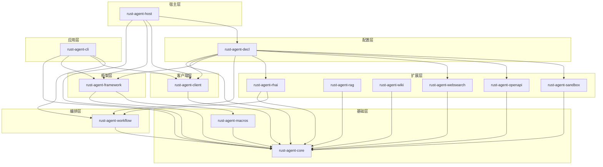

# 15.2 Crate 依赖关系图

以下是 RAF Workspace 中所有 Crate 之间的依赖关系。箭头从依赖者指向被依赖者。

## 依赖关系表

| Crate | 路径 | 依赖的 RAF Crate |
|-------|------|------------------|
| `rust-agent-core` | `crates/core/` | 无（基础层，不依赖其他 RAF Crate） |
| `rust-agent-macros` | `crates/macros/` | `rust-agent-core` |
| `rust-agent-client` | `crates/client/` | `rust-agent-core` |
| `rust-agent-framework` | `crates/framework/` | `rust-agent-core`, `rust-agent-macros` |
| `rust-agent-workflow` | `crates/workflow/` | `rust-agent-core` |
| `rust-agent-rhai` | `crates/rhai/` | `rust-agent-core`, `rust-agent-workflow` |
| `rust-agent-decl` | `crates/decl/` | `rust-agent-core`, `rust-agent-client`, `rust-agent-framework`, `rust-agent-workflow`, `rust-agent-rhai`, `rust-agent-websearch`, `rust-agent-openapi`*, `rust-agent-sandbox`* |
| `rust-agent-openapi` | `crates/openapi/` | `rust-agent-core` |
| `rust-agent-sandbox` | `crates/sandbox/` | `rust-agent-core` |

\* 通过 Cargo optional dependency + feature 引入
| `rust-agent-websearch` | `crates/websearch/` | `rust-agent-core` |
| `rust-agent-rag` | `crates/rag/` | `rust-agent-core` |
| `rust-agent-wiki` | `crates/wiki/` | `rust-agent-core` |
| `rust-agent-host` | `crates/host/` | `rust-agent-core`, `rust-agent-framework`, `rust-agent-client`, `rust-agent-decl` |
| `rust-agent-cli` | `crates/cli/` | `rust-agent-core`, `rust-agent-framework`, `rust-agent-client`, `rust-agent-workflow` |
## Crate 职责说明

| Crate | 职责 |
|-------|------|
| **rust-agent-core** | 核心抽象：IAgent、ITool、IChatClient、ISession、消息类型、错误类型 |
| **rust-agent-macros** | 过程宏：`#[tool]` 属性宏，自动生成 ITool 实现 |
| **rust-agent-client** | LLM 客户端：OpenAI/DeepSeek 兼容的 IChatClient 实现 |
| **rust-agent-framework** | Agent 运行时：AgentBuilder、ChatClientAgent、内置工具、上下文提供器、技能系统、记忆系统 |
| **rust-agent-workflow** | 工作流引擎：图驱动编排、顺序/并发/交接模式、检查点、WorkflowBuilder |
| **rust-agent-rhai** | Rhai 集成：RhaiRuntime、RhaiExecutor（工作流节点）、RhaiTool（Agent 工具） |
| **rust-agent-decl** | 声明式配置：JSON/YAML/TOML、`DeclAgentBuilder`、`ToolResolver`、工作流编译 |
| **rust-agent-openapi** | OpenAPI HTTP 工具：规范解析、Bearer 认证、可选响应 Schema 校验 |
| **rust-agent-sandbox** | 代码沙箱：`ICodeSandbox` 实现、`CodeInterpreterTool`、ExecuteCode 后端 |
| **rust-agent-websearch** | 网络搜索：WebSearch/WebFetch 工具、多后端、反检测 |
| **rust-agent-rag** | RAG 管道：DocumentLoader、Chunker、IEmbeddingModel、IVectorStore、IRetriever traits |
| **rust-agent-wiki** | Wiki 引擎：空间管理、Tantivy 全文搜索、Petgraph 概念图 |
| **rust-agent-host** | 宿主服务：ACP 服务器、Stdio/WebSocket 传输、SessionBridge、AgentRegistry |
| **rust-agent-cli** | CLI 工具：命令行 Agent 交互 REPL |
## 外部关键依赖

| Crate | 用途 |
|-------|------|
| `syn` / `quote` / `proc-macro2` | 过程宏实现（rust-agent-macros） |
| `serde` / `serde_json` | 序列化（所有核心 Crate） |
| `tokio` | 异步运行时（所有 RAF Crate） |
| `async-trait` | 异步 trait（所有核心 Crate） |
| `reqwest` | HTTP 客户端（rust-agent-client, rust-agent-websearch） |
| `tantivy` | 全文搜索（rust-agent-wiki） |
| `petgraph` | 图算法（rust-agent-wiki） |
| `jsonschema` | OpenAPI 响应校验（rust-agent-openapi/validate） |
| `wasmtime` | WASM 沙箱（rust-agent-sandbox/wasm） |
| `rhai` | 嵌入式脚本（rust-agent-rhai） |
| `axum` | WebSocket 服务器（rust-agent-host） |
| `agent-client-protocol` | ACP SDK（rust-agent-host） |
