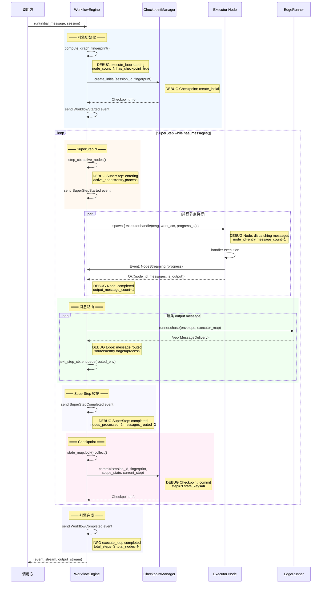

# Rust Agent Framework — 架构优化总结

> 基于 MAF (Microsoft Agent Framework) 参考设计，针对 Rust 实现的架构对齐与优化。

## 一、ChatClient 管道模式重构

### 架构变更

```
重构前:                              重构后:
IAgent                                IAgent ← AgentHost
  └─ ToolLoopAgent (已废弃)             └─ ChatClientAgent
       └─ IAgent (ChatClientAgent)           └─ IChatClient 管道
            └─ IChatClient                       ├─ FunctionInvokingChatClient ← 工具循环
                                                  ├─ PerServiceCallPersistingChatClient
                                                  └─ 叶子 IChatClient (LLM provider)
```

### 关键设计决策

| 决策 | 说明 |
|------|------|
| 工具循环下沉到 IChatClient 层 | 对齐 MAF `FunctionInvokingChatClient` 管道装饰器模式 |
| 消息累积机制 | `msg_tx`/`msg_rx` 双通道传递 assistant(tool_calls)+tool(results) |
| ToolCalls Finish 信号内部化 | `stream.filter()` 过滤，不向消费者泄漏 |
| ToolLoopAgent 标记废弃并删除 | 死代码清理完毕，所有引用移除 |

### 新增文件

| 文件 | 说明 |
|------|------|
| `chat_client_decorators/function_invoking.rs` | 工具调用循环管道装饰器 + 5 个 Mock 测试 |
| `chat_client_decorators/per_service_call_persisting.rs` | 每轮调用持久化装饰器 |
| `chat_client_decorators/mod.rs` | 装饰器模块入口 |

---

## 二、AgentHost 会话注册中心

### 核心能力

- `get_or_create_session(id)` — 从 Store 加载或新建，自动 touch
- `run(messages, session, options)` — 调用前 touch+save，调用后 spawn save
- `cleanup_expired()` — 委托 Store 清理过期会话
- `get_subagent(id)` — 透传 IAgent 子代理查找

### 流式输出资源释放审计

```
AgentHost.run()
  ├─ session.touch_last_active()                   ✅ 同步
  ├─ session_store.save_session()                  ✅ 同步 await
  ├─ agent.run() → BoxStream<AgentResponseResult>  ✅ 返回给调用方
  └─ spawn { save_session(session) }              ✅ 后台任务，Arc 共享引用

ChatClientAgent.run()
  ├─ Phase 1: provider.on_invoking()               ✅ 同步 await
  ├─ Phase 2: chat_client.run()                    ✅ 管道层处理
  │    └─ FunctionInvokingChatClient
  │         ├─ spawn { stream consume + tool exec } │ ✅ rx.drop 后退出
  │         ├─ msg_tx/msg_rx 双通道                 │ ✅ unfold drop 时关闭
  │         └─ unfold 状态机                        │ ✅ stream drop 时释放
  ├─ Phase 3: spawn { collect + post-providers }   ✅ rx 关闭后退出
  └─ inspect 闭包 (tx.send clone)                   ✅ stream drop 时释放 tx
```

**结论**: 全链路 Arc 共享引用 + mpsc sender drop 关闭机制，无内存泄漏。

---

## 三、Checkpoint 引擎集成

### 工作流引擎变更

| 文件 | 变更 |
|------|------|
| `engine.rs` | 新增 `checkpoint_manager` 字段 + `with_checkpoint_manager()` 构造器 |
| `engine.rs` | `execute_loop` 中 `create_initial` + 每轮 `commit` |
| `engine.rs` | `EngineWorkContext` 状态读写改为真实实现（`Arc<Mutex<HashMap>>`） |
| `manager.rs` | 修复 `parking_lot::RwLock` 跨 `await` 的 `Send` 问题 |

### 调试日志（DEBUG 级别，每日开发可用）

```
DEBUG WorkflowEngine::execute_loop starting     node_count=2 fingerprint=xxx has_checkpoint=true
DEBUG Checkpoint: create_initial                session_id=test-session
DEBUG SuperStep: entering step=0                active_nodes=entry,process
DEBUG Node: dispatching messages                node_id=entry message_count=1
DEBUG Node: completed                           node_id=entry output_message_count=1
DEBUG Edge: message routed                      source=entry target=process
DEBUG SuperStep: completed step=0               nodes_processed=2 messages_routed=3
DEBUG Checkpoint: commit step=0                 session_id=test-session state_keys=0
 INFO WorkflowEngine::execute_loop completed    total_steps=3 total_nodes=5
```

### 执行流程序列图



### 关键时序说明

| 阶段 | 时机 | 日志 |
|------|------|------|
| 初始化 | `execute_loop` 入口，图结构确认后 | `execute_loop starting` |
| create_initial | 初始化完成，首个 SuperStep 之前 | `Checkpoint: create_initial` |
| SuperStep 进入 | 每个 step 的消息分发前 | `SuperStep: entering` |
| 节点调度 | 每个活跃节点收到消息时 | `Node: dispatching messages` |
| 节点完成 | tokio::spawn 返回后 | `Node: completed` |
| 边路由 | 每条 output message 路由时 | `Edge: message routed` |
| SuperStep 完成 | 所有节点完成，消息路由后 | `SuperStep: completed` |
| commit | SuperStep 完成后，下一轮开始前 | `Checkpoint: commit` |
| 引擎完成 | while 循环退出后 | `execute_loop completed` |

---

## 四、Session 过期清理 (cleanup_expired)

### TTL 驱逐逻辑

| Store | TTL 支持 | 驱逐策略 |
|-------|---------|---------|
| `InMemorySessionStore` | `with_ttl()` | 内存遍历 `last_active_at`/`created_at` |
| `FileSystemSessionStore` | `with_ttl()` | **mtime 预过滤** + JSON 解析时间戳 + 批量删除 |
| `IsolationScopedSessionStore` | 透传 inner | 委托内部 Store |

### FileSystemStore 性能优化

```
优化前:                         优化后:
for each file:                  for each file:
  read_content()   ← I/O        │  check mtime()  ← 快速过滤（跳过活跃文件）
  parse_json()     ← CPU        │    (if mtime < idle_threshold → skip)
  validate(ttl)    ← logic      ├─ read_content() ← 仅处理过期候选
  remove_file()    ← I/O        ├─ parse_json()
                                 └─ push(to_delete)

                                batch_remove(to_delete)  ← 批量删除 + 错误日志
```

- **mtime 预过滤**: `AgentHost.run()` 每次调用前后写文件，文件 mtime 反映会话活跃度。mtime 在 idle 阈值内的文件直接跳过 JSON 解析，减少 I/O 和 CPU 开销
- **批量删除**: 收集过期路径后统一删除，配合 `tracing::warn!` 记录删除失败
- **损坏文件清理**: 不可读/不可解析的 JSON 文件主动加入删除队列

### 测试覆盖（9 个）

| 存储 | 测试 | 场景 |
|------|------|------|
| InMemory | `no_ttl_configured` | 无 TTL 配置，驱逐数 = 0 |
| InMemory | `idle_timeout` | 3 sessions, 1 touch 保留, 2 驱逐 |
| InMemory | `lifetime_timeout` | 1 session 超过 lifetime 后移除 |
| InMemory | `concurrent_sessions` | 10 并发创建, 4 touch 保留, 6 驱逐 |
| InMemory | `already_deleted` | 手动删除后 cleanup 不重复计数 |
| FileSystem | `no_ttl` | 无 TTL 配置 |
| FileSystem | `idle_timeout` | 2 sessions, 1 touch 保留 |
| FileSystem | `lifetime_timeout` | 1 session 超过 lifetime |
| FileSystem | `concurrent` | 6 并发创建 → 全部过期驱逐 |

---

## 五、IAgent 子代理体系

### 设计简化

```rust
// IAgent trait — 仅保留 get_subagent，移除 list_subagents（避免过度设计）
pub trait IAgent: Send + Sync {
    fn get_subagent(&self, _id: &AgentId) -> Option<Arc<dyn IAgent>> { None }  // 默认空
    // ...
}
```

| 类型 | get_subagent 行为 |
|------|-------------------|
| `ChatClientAgent` | 继承默认 → None（无子代理） |
| `GraphFlow` | HashMap 查找 → 返回实际子代理 |
| `WorkflowAgent` | Vec 查找 → 返回工作流节点代理 |
| `AgentHost` | `host.get_subagent(id)` → 透传内部 agent |

### 流式输出场景验证

3 个端到端测试验证了 `get_subagent` 在 ChatClient 管道模式下的正确性：
- 单 agent 无子代理 → 返回 None
- 多 agent 管道代理 → 正确查找子代理
- 流式输出并发调用 → 10/10 成功，线程安全

---

## 六、代码清理

| 删除 | 原因 |
|------|------|
| `ToolLoopAgent` (整个文件) | 已被 `FunctionInvokingChatClient` 替代 |
| `agents/mod.rs` 子模块声明 | 目录保留为未来扩展 |
| `#[allow(deprecated)]` 注解 | 无废弃代码残留 |
| `list_subagents()` trait 方法 | 过度设计，`get_subagent(id)` 足够 |
| 所有 `ChatClientAgent`/`AgentProxy` 硬编码 `None` | 改用 trait 默认实现 |

---

## 七、测试统计

| 模块 | 测试数 |
|------|--------|
| FunctionInvokingChatClient | 5 |
| AgentHost get_subagent | 3 |
| InMemorySessionStore TTL | 5 |
| FileSystemSessionStore TTL | 4 |
| WorkflowEngine checkpoint | 1 |
| CheckpointManager | 12 |
| CheckpointStore | 5 |
| MessageEnvelope | 4 |
| Tools (13 built-in) | 20 |
| **总计** | **59** |
